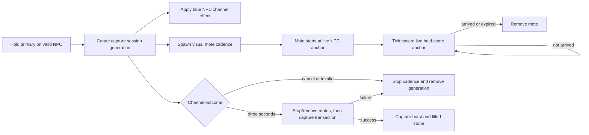

# Dragon Stone Homing VFX Projectile Implementation Plan

- Status: Proposed
- Scope: Tamework framework plus HyDragon Dragon Stone assets/configuration
- Target runtime: Hytale 0.5.6

## Outcome

Replace the Dragon Stone's current world-space particle stream with a rapid stream of visual-only homing motes. Each mote begins at the captured NPC, carries its own attached particle effect, continuously retargets the live position of the Dragon Stone in the player's hand, and disappears on arrival or cancellation.

The capture rules remain unchanged:

- The player holds primary/left click for three seconds.
- The target must remain the locked, tranquilized NPC and satisfy the configured taming-health threshold.
- The existing blue channeling skin effect remains active on the NPC.
- A successful capture still produces the configured burst and filled Dragon Stone.
- Releasing early or invalidating the channel cleans up every mote and the NPC effect.

## Architectural decision

Implement a **projectile-like visual entity**, not a Hytale combat projectile.

Each mote will be a small networked, non-serialized entity containing a transform, an invisible model, a model-attached particle, and a Tamework homing component. A Tamework tick system moves it toward the player's current held-item anchor. It will not contain `ProjectileComponent`, projectile physics, collision, damage, hit interactions, or explosion behavior.

This choice gives us the behavior the effect needs without introducing combat side effects:

- Every mote has an independently updateable position.
- Its particle remains attached while the entity changes course.
- A moving player causes in-flight motes to bend toward the new hand position.
- Cleanup is explicit and tied to the capture-session generation.
- The mote cannot damage, aggro, collide with, or trigger hit logic on another entity.

The generic interaction type will be named `TameworkLaunchHomingVisualProjectile`. The Dragon Stone capture system will use the same spawning service directly instead of repeatedly running an NPC action tree. Direct session ownership makes cancellation, concurrency limits, and cleanup deterministic; the interaction remains available for other Tamework content that needs a one-shot homing visual.

## Why the current particle approach cannot solve this reliably

The current `CaptureChannelVfxSystem` sends independent world-space particle systems from a sampled source position. Once emitted, those particles have no server-side instance handle whose endpoint can be updated. They therefore continue toward the old hand position when the player strafes.

Relevant base-game 0.5.6 behavior reviewed for this plan:

| Evidence | Design consequence |
| --- | --- |
| `ParticleUtil.spawnParticleEffect` sends a one-shot `SpawnParticleSystem` packet with position, rotation, scale, color, and duration. It returns no persistent particle handle. | A world particle cannot be retargeted after launch. |
| `ModelParticle` supports `SystemId`, target part/node, offsets, and `DetachedFromModel`. | A particle configured with `DetachedFromModel: false` can follow a moving model entity. |
| Legacy `ProjectileComponent` enables character collision and invokes `DamageSystems` for living hits, even though velocity can be changed. | A real projectile is unnecessarily coupled to combat behavior. |
| The base-game entity preview path creates a networked, non-serialized model entity from `NetworkId`, `TransformComponent`, and `ModelComponent`. | A lightweight replicated visual entity is an established engine pattern. |
| Model particle effects can also be triggered against a network entity through `SpawnModelParticles`. | If model particles do not auto-start when the entity is created, Tamework has a viable explicit-start fallback. |

## Runtime flow



## Detailed design

### 1. Visual mote entity

Create a Tamework component such as `HomingVisualProjectileComponent` with data-only state:

- Destination player UUID.
- Capture owner UUID.
- Session generation ID.
- Source/locked-target UUID for diagnostics and bulk cleanup.
- Speed in blocks per second.
- Optional turn-rate limit in degrees per second; `0` means direct retargeting with no limit.
- Arrival radius.
- Expiry tick or monotonic deadline.
- Last valid travel direction, if bounded turning or model orientation needs it.

Do not retain a `Player`, `Ref`, `Store`, `World`, or other engine component in this state. The tick system must resolve the player by UUID from its current world/store on every update.

The spawned entity should contain only the components required for replication and rendering:

- `NetworkId`
- the engine's `NonSerialized` marker
- `TransformComponent`
- `ModelComponent`
- `HomingVisualProjectileComponent`
- rotation/head-rotation data only if the selected model path requires it

It must not contain:

- `ProjectileComponent` or the modern combat Projectile component
- a physics body or character-collision provider
- a damage component
- hit/miss/death interactions
- an explosion component
- persistent save data

### 2. Attached particle appearance

HyDragon will supply an invisible model asset whose model-particle entry points at a custom Dragon Stone mote particle:

```json
{
  "SystemId": "HyDragon_DragonStone_CaptureMote",
  "TargetEntityPart": "Self",
  "TargetNodeName": "",
  "DetachedFromModel": false
}
```

The exact model JSON wrapper should follow an existing HyDragon projectile appearance, but it is intentionally consumed as a `ModelAsset`, not by a `Server/Projectiles` combat-projectile definition. The particle should have little or no authored world velocity; the entity transform supplies all forward movement and homing.

The first implementation task is a small runtime spike that verifies:

1. A particle declared on a newly added `ModelComponent` starts automatically.
2. `DetachedFromModel: false` keeps it attached while the server updates the transform.
3. Transform updates replicate smoothly to clients.
4. Removing the visual entity immediately removes its attached effect.

If item 1 fails, send one `SpawnModelParticles` packet after the entity has a network ID. Do not fall back to repeatedly spawning world particles on every mote tick.

### 3. Homing motion

`HomingVisualProjectileSystem` runs on the world/ECS tick and performs the following for each mote:

1. Resolve the destination player UUID in the active world/store.
2. Verify that the owning capture session and generation are still active.
3. Recompute the player's held-item anchor from the current look transform.
4. Calculate `delta = destination - currentPosition`.
5. Move by `min(speed * dt, distance)` toward the destination.
6. Rotate the invisible model to the new travel direction when needed.
7. Remove the mote when it reaches the arrival radius or would overshoot.

Direct per-tick retargeting is the default. It guarantees convergence during sharp strafing and direction reversals. A turn-rate limit may remain configurable for future effects, but the Dragon Stone should initially set it to `0` so visual style cannot cause a mote to miss the hand.

The motion helper must be pure and independently testable. It should reject or safely clamp non-finite positions, non-positive speed, negative/invalid `dt`, and oversized frame deltas. The system removes a mote rather than allowing corrupt state to persist.

Velocity may be replicated in addition to the transform only if the runtime spike shows that client interpolation materially improves motion. It must not be accompanied by collision-capable projectile physics.

### 4. Source and destination anchors

Extract the existing body/hand calculations from `CaptureChannelVfxSystem` into a shared `CaptureChannelAnchorResolver`:

- `resolveTargetBodyAnchor(...)`: the current sensible body-center/visual anchor on the locked NPC.
- `resolveHeldItemAnchor(...)`: the existing view-based right/down/forward approximation for the Dragon Stone.
- `isWithinConfiguredRange(...)`: the existing root-position range check.

At emission time, sample the NPC anchor and create the mote there. While the mote is in flight, recompute only its player-hand destination every tick. This produces the desired NPC-to-stone flow while allowing the endpoint to follow strafing, camera rotation, sprinting, and normal hand movement.

The server anchor is an approximation of the first-person hand, not a client viewmodel socket. Preserve the current offsets as the starting point, then tune them during the in-game pass so arrivals visually meet the stone rather than the camera or torso.

### 5. Capture-session ownership and lifecycle

Give each `CaptureChannelVfxSystem.Session` a monotonically changing generation ID. Store that generation on every spawned mote. A newly started channel for the same player invalidates and removes motes from the previous generation.

Lifecycle requirements:

| Event | Required behavior |
| --- | --- |
| Begin | Lock the NPC, allocate a generation, apply the blue NPC effect, and start the mote cadence. |
| Active tick | Verify player, target, world, item/session, range, and expiration before emitting under the per-session cap. |
| Release/cancel | Stop emission, remove all motes for the generation, and remove the blue NPC effect. |
| Complete | Stop emission and remove generation motes before target removal; then run the existing transactional capture. Play the burst only after capture succeeds. |
| Capture terminal-gate failure | Perform the same cleanup as cancellation and leave the NPC/item unchanged. |
| Player disconnect/world change | Remove the session and all matching motes on the next applicable world tick. |
| Target invalidation/removal | Remove the session and all matching motes. |
| Held-item swap or replacement session | Cancel/replace the old generation and remove its motes. |
| Server/chunk reload | Motes are `NonSerialized` and have a short TTL, so they cannot persist into saved world state. |

All spawn/remove operations must execute on the owning world's command-buffer/ECS path. Async callbacks must carry identifiers and immutable configuration only; they must never capture a `Player` component or stale entity reference.

### 6. Emission cadence and budgets

Initial Dragon Stone tuning:

| Setting | Initial value | Reason |
| --- | ---: | --- |
| Spawn interval | `0.12s` | Roughly 8.3 motes per second; reads as a stream without the current 20-per-second churn. |
| Speed | `8.0` blocks/s | Slow enough to see individual motes while still reaching across the 12-block capture range. |
| Arrival radius | `0.18` blocks | Allows a clean visual arrival at the approximate stone anchor. |
| Lifetime | `2.0s` | Covers a 12-block flight at 8 blocks/s with margin. |
| Turn rate | `0` | Unlimited/direct retargeting for reliable convergence. |
| Per-channel active cap | `16` | Bounds replicated entity count and handles full-range travel. |

Also enforce a conservative per-world global cap. When a cap is reached, skip an emission rather than deleting arbitrary motes or delaying capture logic. The three-second channel creates about 25 motes total, while the active count remains bounded by arrival, TTL, and the cap.

Profile one, four, and eight simultaneous channels before increasing either cadence or cap.

### 7. Reusable interaction contract

Register a stable one-shot interaction type named `TameworkLaunchHomingVisualProjectile`. It should decode flat, inherited fields consistent with existing Tamework interaction codecs:

- `ModelId`
- `Source` and `Destination` using existing interaction target semantics where possible
- `SourceAnchor`
- `DestinationAnchor`
- `Speed`
- `TurnRateDegreesPerSecond`
- `ArrivalRadius`
- `LifetimeSeconds`

The interaction validates its source, destination, model, and numeric limits, then delegates to `HomingVisualProjectileSpawner`. It does not own a repeating schedule and does not perform damage.

The capture feature delegates to the same spawner directly because it already owns the locked target, three-second cadence, and cleanup generation. Do not make the tranquilized NPC repeatedly execute this interaction during a capture channel.

## Configuration contract

Add flat, inherited properties to `TameworkCaptureChannelInteraction` and copy the Begin-phase values into the server-owned session:

```json
{
  "Type": "TameworkCaptureChannel",
  "Phase": "Begin",
  "HomingProjectileEnabled": true,
  "HomingProjectileModelId": "HyDragon_DragonStone_Capture_Mote",
  "HomingProjectileSpawnIntervalSeconds": 0.12,
  "HomingProjectileSpeed": 8.0,
  "HomingProjectileTurnRateDegreesPerSecond": 0.0,
  "HomingProjectileArrivalRadius": 0.18,
  "HomingProjectileLifetimeSeconds": 2.0,
  "HomingProjectileMaxConcurrent": 16,
  "ChannelDurationSeconds": 3.0
}
```

Keep the existing fields and stable interaction ID intact:

- `BeamParticleSystem`
- `BeamNativeLength`
- `BeamNativeDurationSeconds`
- `ScaleBeamToTarget`
- `BeamFromTarget`
- `CaptureBurstParticleSystem`

During rollout, `BeamParticleSystem` is the compatibility fallback. If homing is disabled, the behavior remains unchanged. If homing is enabled but its model asset is missing or invalid, log one actionable warning per asset/session class and use the old beam rather than failing the capture. After in-game validation and one compatibility cycle, the legacy beam path can be deprecated separately.

## Prompt, action, and reset alignment

This work does not change which input starts capture or what the UI promises.

| Interaction path | Gate | Action | Reset/cleanup |
| --- | --- | --- | --- |
| Primary Begin | Existing begin gates: valid empty stone, eligible tranquilized target, range, health threshold, no conflicting session | Lock target; start three-second session, blue skin effect, and homing cadence | Cancel, Complete, timeout, disconnect, invalid target, world/item change |
| Charging Cancel | Primary released before three seconds | Stop session without capture | Remove generation motes and blue effect immediately |
| Charging Complete | Three seconds elapsed and existing terminal capture gates still pass | Stop visuals, execute transactional capture, then successful burst | Capture success/failure cleanup |

## Planned code and asset changes

### Tamework

Create:

- `src/main/java/com/alechilles/alecstamework/vfx/projectile/HomingVisualProjectileComponent.java`
- `src/main/java/com/alechilles/alecstamework/vfx/projectile/HomingVisualProjectileMotion.java`
- `src/main/java/com/alechilles/alecstamework/vfx/projectile/HomingVisualProjectileSpawner.java`
- `src/main/java/com/alechilles/alecstamework/vfx/projectile/HomingVisualProjectileSystem.java`
- `src/main/java/com/alechilles/alecstamework/items/CaptureChannelAnchorResolver.java`
- `src/main/java/com/alechilles/alecstamework/interactions/TameworkLaunchHomingVisualProjectileInteraction.java`
- focused tests for component cloning/state, motion, lifecycle, interaction codec, and architecture constraints

Modify:

- `src/main/java/com/alechilles/alecstamework/TameworkComponentRegistrar.java` — register the component.
- `src/main/java/com/alechilles/alecstamework/Tamework.java` — register the system and interaction codec.
- `src/main/java/com/alechilles/alecstamework/interactions/TameworkCaptureChannelInteraction.java` — add inherited configuration and pass it to Begin.
- `src/main/java/com/alechilles/alecstamework/items/SpawnerFeatureHandler.java` — carry validated configuration through capture start/stop/complete.
- `src/main/java/com/alechilles/alecstamework/items/CaptureChannelVfxSystem.java` — own generation/cadence, use the shared spawner, and clean up session motes.
- `src/test/java/com/alechilles/alecstamework/items/CaptureChannelVfxSystemTest.java` — update cadence and lifecycle coverage.
- `src/test/java/com/alechilles/alecstamework/items/SpawnerFeatureHandlerTest.java` and the existing capture architecture tests — cover delegation and transactional ordering.
- `docs/Interactions.md` — document the reusable interaction and capture fields.

### HyDragon

Create:

- `Common/Items/HyDragon/DragonStone_Capture_Mote.blockymodel`
- `Common/Items/HyDragon/DragonStone_Capture_Mote.png` with a fully transparent visual surface
- `Server/Models/Projectiles/HyDragon/DragonStone_Capture_Mote.json`
- `Server/Particles/HyDragon/DragonStone/HyDragon_DragonStone_CaptureMote.particlesystem`
- `Server/Particles/HyDragon/DragonStone/Spawners/HyDragon_DragonStone_CaptureMote.particlespawner`

Modify:

- `Server/Item/Items/Ingredient/Draconic_Stone.json` — enable and tune the homing visual stream while retaining the capture burst and temporary beam fallback.

Do not add a `Server/Projectiles/...` gameplay projectile asset for this effect. The invisible appearance is loaded directly as the model for the custom visual entity.

## Implementation phases

### Phase 0 — Runtime spike

- [ ] Spawn one non-serialized network model entity in a test world.
- [ ] Confirm its attached particle starts and follows transform changes.
- [ ] Confirm repeated transform updates replicate smoothly to another client.
- [ ] Confirm entity removal also removes the visual with no lingering particle.
- [ ] Choose automatic model-particle start or the one-shot `SpawnModelParticles` fallback based on observed behavior.
- [ ] Record the result in the Tamework interaction documentation or code comment at the integration point.

Exit criterion: one visual mote can be moved along an arbitrary server-defined path and removed cleanly without any projectile/combat component.

### Phase 1 — Core visual-projectile infrastructure

- [ ] Implement and register `HomingVisualProjectileComponent`.
- [ ] Implement pure movement/arrival/turning math with unit tests.
- [ ] Implement the spawner with strict model and numeric validation.
- [ ] Implement and register the tick system.
- [ ] Add TTL, invalid-target, world-mismatch, and corrupt-state cleanup.
- [ ] Add per-session and per-world caps.
- [ ] Add an architecture test proving the visual path does not use combat projectile, collision, or damage systems.

Exit criterion: Tamework can spawn a bounded visual mote that homes to a moving player and always cleans itself up.

### Phase 2 — Reusable one-shot interaction

- [ ] Implement `TameworkLaunchHomingVisualProjectileInteraction` with inherited codec fields.
- [ ] Register the stable interaction ID.
- [ ] Delegate exclusively to `HomingVisualProjectileSpawner`.
- [ ] Add codec/default/invalid-input tests.
- [ ] Document a minimal JSON example in `docs/Interactions.md`.

Exit criterion: content can launch one harmless homing visual from configured interaction endpoints without capture-specific code.

### Phase 3 — Capture-channel integration

- [ ] Extract and test the shared NPC and held-item anchor resolver.
- [ ] Add the flat homing fields to `TameworkCaptureChannelInteraction`.
- [ ] Add a unique generation to every capture session.
- [ ] Emit motes from the locked NPC at the configured cadence while all active gates pass.
- [ ] Recompute each mote's held-stone destination every tick.
- [ ] Remove all generation motes on cancel, failure, replacement, timeout, disconnect, world change, and completion.
- [ ] Stop/remove motes before deleting the captured target.
- [ ] Preserve the existing successful capture burst and blue NPC skin effect.
- [ ] Keep the current world-particle beam as disabled-by-default fallback when homing is active.

Exit criterion: the existing capture transaction behaves identically, while its in-progress stream follows a strafing player's held stone.

### Phase 4 — HyDragon assets and tuning

- [ ] Author the invisible mote model and transparent texture.
- [ ] Derive a compact blue/white energy-orb particle from the preferred healing-beam visual language.
- [ ] Attach the particle to the model root with `DetachedFromModel: false`.
- [ ] Ensure the particle has no independent forward travel that fights the entity motion.
- [ ] Configure the Dragon Stone with the initial cadence, speed, TTL, arrival radius, and cap.
- [ ] Tune hand offsets, mote size, opacity, lifetime, and cadence in first- and third-person views.
- [ ] Verify the final capture burst remains visually distinct from the channel stream.

Exit criterion: the stream reads as energy being pulled from the dragon into the stone and contains no invisible-model artifacts or stray particle chains.

### Phase 5 — Verification and rollout

- [ ] Run the complete Tamework Maven test suite.
- [ ] Validate modified JSON/assets against the runtime schemas and reference graph.
- [ ] Build an isolated Tamework runtime JAR and deploy it with the matching HyDragon assets.
- [ ] Restart the test server/client so component, interaction, model, and particle registries reload.
- [ ] Execute the full in-game matrix below.
- [ ] Profile entity/network load with one, four, and eight simultaneous channels.
- [ ] Keep fallback configuration available for one validation cycle.
- [ ] Remove or formally deprecate the old beam fields only in a later compatibility change.

## Automated test plan

### Pure motion tests

- Stationary destination advances by exactly `speed * dt` without overshoot.
- A step that reaches the arrival radius snaps/finishes deterministically.
- A moving destination is sampled anew and the next step changes direction.
- Reversing the destination across the mote produces convergence rather than stale travel.
- Zero/negative/non-finite speed, position, and `dt` are rejected or safely removed.
- Large frame deltas are clamped or arrive without tunneling past the destination.
- Optional turn-rate math respects its bound; turn rate `0` directly retargets.

### ECS/lifecycle tests

- Spawned motes are networked and non-serialized.
- No spawned mote contains projectile, physics/collision, damage, hit, or explosion components.
- Missing player, invalid ref, expired TTL, world mismatch, and missing session generation all remove the mote.
- Cancel and Complete remove every mote belonging to that generation on the next valid tick.
- Starting a replacement channel invalidates the previous generation only.
- Per-session and per-world caps skip excess emissions.
- Two players channeling different NPCs cannot remove or retarget one another's motes.
- Capture burst runs only after a successful capture transaction.
- A missing/invalid homing model logs once and selects the legacy beam fallback without breaking capture.

### Thread-affinity checks

- No tick/async state retains a `Player` component.
- Player and entity references are resolved by UUID in the active world/store.
- Entity addition, transform mutation, and removal occur through the owning ECS/command-buffer path.

## In-game validation matrix

Test every scenario with a freshly spawned NPC that is damaged below its configured taming-health threshold and then tranquilized:

| Scenario | Expected result |
| --- | --- |
| Player stationary at short, medium, and maximum capture range | Motes originate at the NPC and terminate at the held Dragon Stone. |
| Continuous left/right strafe | Every in-flight mote curves toward the current hand position; no stale endpoint hangs in space. |
| Abrupt strafe reversal | Existing motes reverse course smoothly and still arrive. |
| Forward/back sprint during channel | Motes converge without crossing through and continuing away from the player. |
| Rotate view while standing or strafing | Destination tracks the recomputed held-item anchor rather than eye center. |
| Release before three seconds | Capture does not occur; cadence, motes, and blue NPC effect disappear promptly. |
| Complete a valid channel | Motes stop, NPC is captured, filled item remains valid, and burst plays once. |
| Target becomes invalid or leaves range | Channel fails cleanly with no orphaned mote or effect. |
| Swap item, disconnect, or change world | The owning session and all of its motes are removed. |
| Two or more simultaneous players | Each stream follows only its owner; no cross-session cleanup or targeting. |
| Walk between the mote and its destination | Mote passes harmlessly through entities and terrain without damage, aggro, or hit effects. |
| Restart after a channel | No visual-projectile entity reloads from world persistence. |

Target visual acceptance:

- Active motes arrive within approximately `0.25` blocks of the live held-stone anchor under normal movement.
- No mote persists beyond its configured TTL.
- Cancel/complete cleanup is visible no later than the next applicable server tick plus normal network latency.
- The stream shows individual readable energy motes, not a rigid particle chain.
- There are no collision sounds, damage events, aggro changes, claim/combat hooks, or lingering particles.

## Risks and mitigations

| Risk | Mitigation |
| --- | --- |
| Model particles do not auto-start on dynamic entity creation. | Verify first; if necessary, send one `SpawnModelParticles` packet after `NetworkId` assignment. |
| Transform-only replication looks jerky. | Prototype at normal tick rate; add non-colliding replicated velocity for interpolation only if verified useful. |
| The server hand anchor does not exactly match the first-person item. | Reuse the current view-relative formula, then tune right/down/forward offsets in both perspectives. |
| Fast direction changes produce unnatural loops. | Use unlimited direct retargeting for the Dragon Stone; keep bounded turning optional. |
| Entity churn is too expensive in multiplayer. | Start at 0.12-second cadence, enforce per-session/per-world caps, short TTL, and profile concurrent channels. |
| A content pack lacks the configured model. | Warn once and use the existing world-particle beam fallback; never fail gameplay capture because VFX is missing. |
| Visual entities persist after abnormal shutdown. | Mark them non-serialized and retain an in-memory TTL as a second cleanup boundary. |
| A real projectile implementation accidentally re-enters the design. | Architecture test and code review rule forbid combat projectile/collision/damage components in this package. |

## Suggested commit sequence

Keep changes reviewable and avoid mixing framework behavior with content tuning:

1. Tamework — `Feat: add homing visual projectile entities`
2. Tamework — `Feat: expose homing visual projectile interaction`
3. Tamework — `Feat: drive capture streams with homing motes`
4. Tamework — `Test: cover homing capture projectile lifecycle`
5. HyDragon — `Feat: add Dragon Stone capture mote assets`
6. HyDragon — `Feat: enable homing Dragon Stone capture stream`

## Definition of done

- The Dragon Stone retains all current eligibility, channel, capture, release, and item-state behavior.
- During the three-second channel, a stream of independent visual motes travels from the locked NPC to the player's held stone.
- In-flight motes continuously home to the moving hand and visibly converge during strafing and reversals.
- The implementation uses no combat projectile, collision, damage, or hit path.
- Every success, cancellation, failure, replacement, disconnect, world change, and timeout path removes its visual entities and blue NPC effect.
- Automated tests, schema/reference validation, isolated build, multiplayer performance checks, and the in-game matrix pass.
- The legacy beam remains a safe fallback until the homing path completes its validation cycle.
