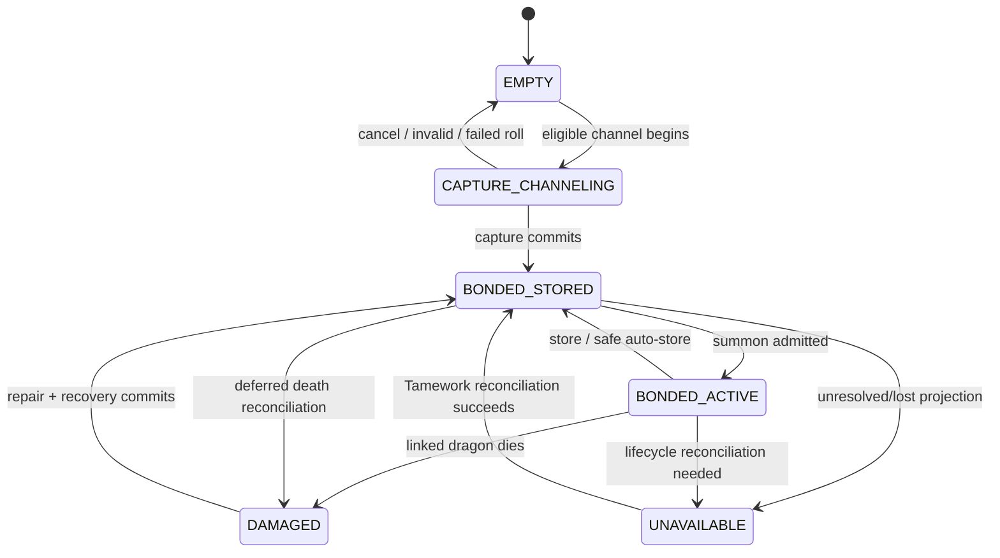

# Draconic Capture, Summoning, and Maintenance Specification

Status: Draft implementation contract
Scope: Full-sized dragons only; Miniwyvern is specified separately

## 1. Purpose and boundaries

This specification defines HyDragon's player-facing Draconic Stone loop: weaken and tranquilize a wild dragon, attempt a tiered capture, retain that exact dragon in a bonded stone, summon or store it, enforce one active full dragon, and recover the bond after death through repair.

HyDragon supplies the items, balance data, messages, effects, and maintenance rules. Tamework owns the generic capture transaction, bonded-vessel identity, profile lifecycle, and population admission.

Related specifications:

- [Plugin architecture](plugin-architecture.md)
- [Dragon content and encounters](dragon-content-encounters.md)
- [Soul Bond and Miniwyvern](soul-bond-miniwyvern.md)
- Tamework [capture policy](https://github.com/Alechilles/AlecsTamework/blob/main/docs/specs/hydragon/capture-policy.md)
- Tamework [bonded vessels](https://github.com/Alechilles/AlecsTamework/blob/main/docs/specs/hydragon/bonded-vessels.md)
- Tamework [population groups](https://github.com/Alechilles/AlecsTamework/blob/main/docs/specs/hydragon/population-groups.md)
- Tamework [integration contract](https://github.com/Alechilles/AlecsTamework/blob/main/docs/specs/hydragon/integration-contract.md)

## 2. Locked decisions

- Miniwyvern is Soul Bond-exclusive. `Wyvern_Mini` and `Tamed_Wyvern_Mini` are removed from every Draconic Stone allowlist and override map.
- Full dragon flight uses Tamework's Flightmaster's Talisman only.
- A captured dragon remains the same Tamework profile for the lifetime of the bonded stone.
- A player may own multiple bonded full-dragon stones but may have at most one full dragon active at a time.
- Stones are bound to the capturing owner. Dropping or trading the item does not transfer profile ownership.
- The shipped maintenance policy is a short configurable summon/store swap cooldown plus death repair. Duration and energy budgets are deferred optional extensions, not MVP behavior.

## 3. Requirements

### Capture eligibility and tiers

- **HYD-CAP-001:** Initial Draconic Stone capture MUST allow only configured wild full-dragon roles; storing may target only the exact linked tamed full-dragon profile. Miniwyvern roles MUST always be denied, including after config reload or capability degradation.
- **HYD-CAP-002:** A wild capture attempt MUST require a living target, capture-eligible role, range and line-of-interaction validity, health at or below the configured threshold, and `Tw_Status_Tranquilized`. The current 20% health threshold is the initial default.
- **HYD-CAP-003:** HyDragon MUST ship Iron, Thorium, Cobalt, Adamantium, and Ancient/Mithril stone tiers with strictly increasing capture power. The existing `Draconic_Stone` item ID remains the Iron-tier compatibility ID.
- **HYD-CAP-004:** Each full-dragon species/difficulty MUST declare capture resistance, minimum eligible stone tier, base chance or modifier inputs, and whether special encounter conditions are required.
- **HYD-CAP-005:** The Ancient/Mithril tier MUST succeed with 100% probability once every non-probability eligibility condition is satisfied. It MUST NOT bypass health, tranquilizer, ownership, encounter, capacity, or role requirements.
- **HYD-CAP-006:** Capture validation and the random roll MUST execute within the Tamework capture-policy transaction. HyDragon MUST provide policy inputs and presentation but MUST NOT perform an independent pre-roll.
- **HYD-CAP-007:** Failed validation MUST consume nothing. An eligible failed roll MUST leave the target alive and uncaptured, retain the unchanged empty stone, clear the channel presentation, and apply the configured retry cooldown.

### Bonded vessel and active companion

- **HYD-CAP-008:** A successful capture MUST atomically tame/assign the dragon, create or preserve one canonical Tamework profile, and bind that profile to the stone used for capture.
- **HYD-CAP-009:** The bonded item MUST remain linked while the dragon is stored, active, dead, damaged, unloaded, or temporarily unavailable. Summoning MUST NOT turn it back into an unlinked empty capture item.
- **HYD-CAP-010:** The vessel lifecycle MUST implement the states and transitions in section 5, with item appearance and interaction availability derived from authoritative lifecycle state.
- **HYD-CAP-011:** Every full-dragon species MUST join population group `hydragon:full_dragons`, configured as unlimited owned and one active per owner. Summon, revive, migration, and encounter-recovery paths MUST all use Tamework admission rather than a HyDragon-only count.
- **HYD-CAP-012:** The owner MUST be able to summon a stored healthy dragon, store the active linked dragon, recall it, issue supported combat/follow commands, and inspect why an unavailable state cannot transition.
- **HYD-CAP-013:** Store/recall MUST act only on the stone's linked profile. Proximity lookup, role lookup, or a newly spawned replacement MUST never substitute for an unavailable linked dragon.

### Flight and maintenance

- **HYD-CAP-014:** A dragon configured for avatar flight MUST require Tamework's Flightmaster's Talisman and no other mod item. Ground-mount-only dragons MUST not require the talisman.
- **HYD-CAP-015:** HyDragon MUST author a short summon/store swap cooldown through Tamework's bonded-vessel `TransitionCooldownMs` field. Tamework MUST be the sole enforcement and durable-state authority; the cooldown prevents rapid swapping without imposing a maximum summon duration or energy budget.
- **HYD-CAP-016:** The vessel integration MUST expose safe, versioned extension hooks for a future mutually exclusive duration or energy budget, but MVP MUST ship both extensions disabled. Revitalizing Essence MUST be used only for death repair in MVP.
- **HYD-CAP-017:** When a bonded full dragon dies, Tamework's death record MUST be preserved and the vessel MUST become `DAMAGED`. A damaged stone cannot summon until repaired and must use cracked/red/weakened visual treatment.
- **HYD-CAP-018:** Repair MUST verify the owner, linked dead profile, damaged state, Revitalizing Essence input, and population admission before committing. Success consumes the configured essence quantity exactly once, invokes the Tamework recovery/revive contract, restores `BONDED_STORED`, and never creates a new profile.
- **HYD-CAP-019:** All lifecycle, cooldown, ownership, and operation identifiers MUST survive server restart, item movement, player logout, chunk unload, and ordinary Tamework capture/profile persistence.
- **HYD-CAP-020:** Legacy stones and captured companions MUST migrate non-destructively according to section 10. Ambiguous or duplicated links MUST be quarantined from activation and reported, not guessed or deleted.

## 4. Stone tier and policy data

### 4.1 Stable item IDs

| Tier | Capture power | Item ID | Material identity | Rule |
| --- | ---: | --- | --- | --- |
| Iron | 1 | `Draconic_Stone` | Iron | Preserves the shipped item ID |
| Thorium | 2 | `Draconic_Stone_Thorium` | Thorium | New asset |
| Cobalt | 3 | `Draconic_Stone_Cobalt` | Cobalt | New asset |
| Adamantium | 4 | `Draconic_Stone_Adamantium` | Adamantium | New asset |
| Ancient | 5 | `Draconic_Stone_Ancient` | Mithril/ancient material | Guaranteed after eligibility |

Recipes and material tags are defined in [Dragon content and encounters](dragon-content-encounters.md). Exact chance curves remain balance data, not Java constants.

### 4.2 Policy inputs

HyDragon's Tamework spawner/capture declarations must provide or reference:

```text
stoneTierId
chanceMode: Probability
capturePower
guaranteedWhenEligible
allowedRoleIds
tamedRoleOverrides
maxHealthPercent
requiredEffectId
retryCooldown
```

Species data must provide:

```text
captureResistance
minimumStoneTier
rarityModifier
difficultyModifier
conditionCurve
specialEligibilityRequirementIds
```

The Tamework [capture-policy specification](https://github.com/Alechilles/AlecsTamework/blob/main/docs/specs/hydragon/capture-policy.md) is authoritative for formula evaluation, random-source injection, validation ordering, result reasons, and transaction boundaries. HyDragon assets are authoritative for the values.

## 5. Vessel lifecycle



`UNAVAILABLE` is a protective state, not a new gameplay penalty. It prevents duplicate summoning while Tamework determines whether the linked entity is active, lost, in another world, or awaiting recovery. The player receives a reason and a safe retry path.

### State presentation

| State | Primary interaction | Visual expectation |
| --- | --- | --- |
| `EMPTY` | Capture channel | Existing neutral stone |
| `CAPTURE_CHANNELING` | Cancel/complete channel | Existing homing mote, beam, aura, burst |
| `BONDED_STORED` | Summon linked dragon | Elemental glow plus stored dragon name/species |
| `BONDED_ACTIVE` | Store or command linked dragon | Active/radiating state distinct from stored |
| `DAMAGED` | Repair | Cracks, red tint, weakened/intermittent glow |
| `UNAVAILABLE` | Inspect/reconcile | Muted state; no summon action |

Item states may be implemented through Hytale item variants and Tamework vessel metadata, but visual state must never be the authoritative lifecycle source.

## 6. Capture flow

1. Player targets a permitted full dragon with an empty stone.
2. Tamework and registered HyDragon policy inputs validate role, life state, owner rules, capacity, minimum tier, health, tranquilizer, distance, and special requirements.
3. On success, the existing three-second `TameworkCaptureChannel` presentation begins.
4. Completion revalidates all volatile conditions and performs exactly one capture roll.
5. A failed roll emits a localized result with useful cause/category, leaves the NPC and stone in valid states, and starts retry cooldown.
6. A successful roll commits capture/profile/owner/vessel linkage as one operation.
7. HyDragon adds domain metadata only after receiving the committed capture result, keyed by the Tamework operation/profile identifiers.

The current homing projectile effect remains presentation only and cannot determine capture success.

## 7. Summon, store, commands, and mounts

### Summon preflight

A summon is admitted only when:

- the actor owns the linked profile;
- the vessel is healthy and stored;
- the profile is not already projected or being transitioned;
- `hydragon:full_dragons` has active capacity;
- target placement is safe and within the configured range;
- Tamework's bonded-vessel transition cooldown allows it;
- all required Tamework capabilities are available.

On failure, the item and profile remain unchanged and the player sees a stable reason code translated by HyDragon.

### Commands

Tamed full-dragon roles should expose, where behaviorally supported:

- Follow, Hold, and Idle/Wander;
- Defend and Aggressive modes;
- Attack Target and Clear Target;
- Move To, Recall, Set Home, and Return Home;
- Mount for configured ground or avatar-flight roles.

HyDragon may expose these through the bonded stone and/or a HyDragon command item, but must delegate canonical profile linking and command execution to Tamework.

### Flight

The current Nordic Drake `MountMode: TameworkAvatarFlight` and `AvatarFlightConfig: HyDragonNordicDrake` remain the reference integration. Other flying species require their own validated avatar-flight assets. Mount entry is denied with a localized Flightmaster's Talisman requirement when the player lacks the Tamework item.

## 8. MVP maintenance policy and extension hooks

The Draconic Stone's Tamework spawner asset sets the sole authoritative swap duration through `Vessel.TransitionCooldownMs`; the initial HyDragon tuning value is `10000` ms. Tamework starts, persists, enforces, and reports that cooldown after both a successful summon and a successful store. HyDragon localizes the returned remaining duration but MUST NOT mirror `cooldown_until_ms` or enforce a second balance cooldown.

`Server/HyDragon/StoneMaintenance/Default.json` controls the HyDragon-owned death-repair policy and records that duration/energy extensions remain disabled:

```json
{
  "Repair": {
    "ItemId": "Revitalizing_Essence",
    "Quantity": 1
  },
  "FutureExtensions": {
    "DurationEnabled": false,
    "EnergyEnabled": false
  }
}
```

The repair quantity remains data-driven. Death damage and repair are independent of the Tamework transition cooldown. Tamework's existing technical anti-spam guard remains an implementation safeguard, not a separately advertised HyDragon balance timer.

### Repair transaction

Repair MUST use the durable cross-plugin saga defined by Tamework's [bonded-vessel death and repair contract](https://github.com/Alechilles/AlecsTamework/blob/main/docs/specs/hydragon/bonded-vessels.md#death-and-lost-state):

1. HyDragon derives a stable caller namespace/idempotency key and asks Tamework to prepare `DEAD(g) -> STORED(g+1)` for the exact binding, generation, owner, and damaged source fingerprint. Preparation reserves the transition without consuming material.
2. HyDragon durably records the repair operation, exact-CAS consumes Revitalizing Essence once, and records `MATERIAL_CONSUMED` under the same key.
3. HyDragon commits the prepared Tamework operation. Retries query or commit with that same key; they never prepare a second transition or consume a second essence.
4. HyDragon marks the local operation committed only after Tamework reports terminal success. An unknown or transient result remains pending and is not refunded while Tamework might still commit.
5. Only a terminal pre-apply denial authorizes an idempotent refund to the exact source. When exact reinsertion is unsafe, HyDragon creates a durable owner recovery claim instead. A repair can converge to a repaired vessel or one refund/recovery claim, never both.

Restart recovery MUST query Tamework by caller/idempotency key rather than persist a process-local preparation token.

The config schema may reserve namespaced data for a future `DURATION` or `ENERGY` extension, but those modes are not release requirements. If implemented later, they must be mutually exclusive, reuse the Tamework bonded-vessel lifecycle, and receive their own acceptance tests and migration rules. MVP must not drain energy, auto-store on a timer, or use Revitalizing Essence as routine fuel.

## 9. Failure and concurrency safety

- One operation lock per vessel/profile pair covers capture, summon, store, cooldown updates, death reconciliation, and repair.
- Population admission is obtained before projection and released only through the Tamework lifecycle result.
- A repaired dragon is restored once. Retried repair callbacks follow the section 8 saga and reuse its caller/idempotency key across both systems.
- If a store transition fails transiently, the dragon is made non-interactive for duplicate transitions and retried on the world thread. It is not killed or replaced.
- A dropped stolen stone remains linked to its original owner. A non-owner can inspect it but cannot summon, store, repair, or transfer it.
- Administrative recovery must relink or return the unique vessel; it must never clone the profile into a second stone.

## 10. Current-state migration

Current implementation gaps and migrations:

| Current state | Required migration |
| --- | --- |
| One `Draconic_Stone` tier | Preserve ID as Iron; add four tiers and parented Tamework configs |
| Capture is deterministic | Introduce Tamework capture-policy data; Ancient only is guaranteed |
| One allowlist mixes wild capture and tamed roles | Restrict initial capture to wild roles; use the bonded-vessel store path only for the exact linked tamed profile |
| Filled state returns to empty on spawn | Enable the Tamework bonded-vessel mode; never clear the link on summon |
| Stone allows Miniwyvern | Remove both Miniwyvern roles and their tamed override before enabling Soul Bond |
| Rock Drakes are absent from allowlist | Add only after their tamed roles and species capture data pass validation |
| 500 ms capture/spawn cooldown | Retain only as/replace with explicit technical anti-spam cooldown; do not present as balance cooldown |
| No damaged/active item states | Add item variants, icons/models, localization, and lifecycle mapping |
| No HyDragon command asset/config | Add a role-scoped command surface or expose equivalent bonded-stone actions |

Legacy filled stones require a migration reader for the prior captured metadata. If exactly one valid profile can be resolved, it becomes that item's bonded link. If zero or multiple profiles resolve, the item is preserved but set `UNAVAILABLE`, and diagnostics provide an operator recovery path.

Legacy captured Miniwyverns follow the migration rules in [Soul Bond and Miniwyvern](soul-bond-miniwyvern.md); they are never converted into full-dragon vessels.

## 11. Configuration and asset map

| Asset/config | Work |
| --- | --- |
| `Server/Item/Items/Ingredient/Draconic_Stone.json` | Preserve as Iron; add bonded/active/damaged presentation and new interaction mapping |
| `Server/Item/Items/Ingredient/Draconic_Stone_{Thorium,Cobalt,Adamantium,Ancient}.json` | New tier items and recipes |
| `Server/Tamework/Items/Spawners/HyDragonDraconicStone*.json` | Tiered stone power, probability mode, and bonded-vessel declarations; no Miniwyvern roles |
| `Server/Tamework/CapturePolicies/HyDragonDragons.json` | Per-role capture resistance, minimum power, chance multiplier, missing-health bonus, and Ancient-tier guarantee |
| `Server/Tamework/Companion/HyDragonDragons.json` | Role-scoped revive/placement/recall behavior |
| `Server/Tamework/Items/Commands/HyDragonDragonCommand.json` | Commands if not exposed through vessel actions |
| `Server/Tamework/PopulationGroups/HyDragonFullDragons.json` | `hydragon:full_dragons` membership and active cap |
| `Server/HyDragon/DragonSpecies/*.json` | Resistance, minimum tier, encounter eligibility |
| `Server/HyDragon/StoneMaintenance/Default.json` | Repair balance and disabled future-extension flags; it does not duplicate the vessel cooldown |
| `Common/Items/HyDragon/` and `Common/Icons/ItemsGenerated/` | Tier, filled, active, and damaged visuals |
| `Server/Languages/{en-US,pt-BR,de-DE,fr-FR,es-ES}/server.lang` | Names, descriptions, prompts, failures, and cooldown/repair status with exact key/placeholder parity per the [content localization contract](dragon-content-encounters.md#53-localization-catalogs) |

These paths match the config families fixed by the [Tamework integration contract](https://github.com/Alechilles/AlecsTamework/blob/main/docs/specs/hydragon/integration-contract.md).

## 12. Acceptance criteria

- Hydra, Nordic Drake, and each completed full-sized Rock Drake role can be configured for capture; Miniwyvern is denied with every tier.
- At 21% health or without tranquilizer, no stone is consumed and no random roll occurs.
- A low-tier stone is rejected below a species minimum; Ancient succeeds every eligible deterministic test.
- Seeded policy tests cover success, failed roll, cancellation, moved-out-of-range, target death, simultaneous capturers, and stale channel completion.
- Capturing, summoning, storing, restarting, and summoning again always returns the same profile ID and preserved name/health/progression.
- Two different bonded stones cannot project two full dragons for one owner; the rejected stone remains unchanged.
- Losing the Flightmaster's Talisman blocks avatar-flight mount entry but not ground mount or ordinary follow/combat behavior.
- Summon/store swap cooldown survives restart, blocks rapid swapping without altering the active dragon, and reports its remaining duration.
- Dragon death produces a damaged stone; a repeated repair request consumes one essence and restores one profile.
- Non-owner, inventory-full, unsafe-placement, missing-capability, and restart-mid-operation tests leave recoverable state and no duplicates.

## 13. Phased dependencies

| Phase | HyDragon work | Required Tamework work |
| --- | --- | --- |
| C0 | Remove Miniwyvern from stone allowlist; add role/content validation | Existing public API |
| C1 | Add tier items, recipes, species capture data, and UX | [Capture policy](https://github.com/Alechilles/AlecsTamework/blob/main/docs/specs/hydragon/capture-policy.md) |
| C2 | Convert filled stones to persistent bonded states | [Bonded vessels](https://github.com/Alechilles/AlecsTamework/blob/main/docs/specs/hydragon/bonded-vessels.md) |
| C3 | Enforce one active full dragon | [Population groups](https://github.com/Alechilles/AlecsTamework/blob/main/docs/specs/hydragon/population-groups.md) |
| C4 | Add swap cooldown, death damage, repair, and migration | C1-C3 and [integration contract](https://github.com/Alechilles/AlecsTamework/blob/main/docs/specs/hydragon/integration-contract.md) |
