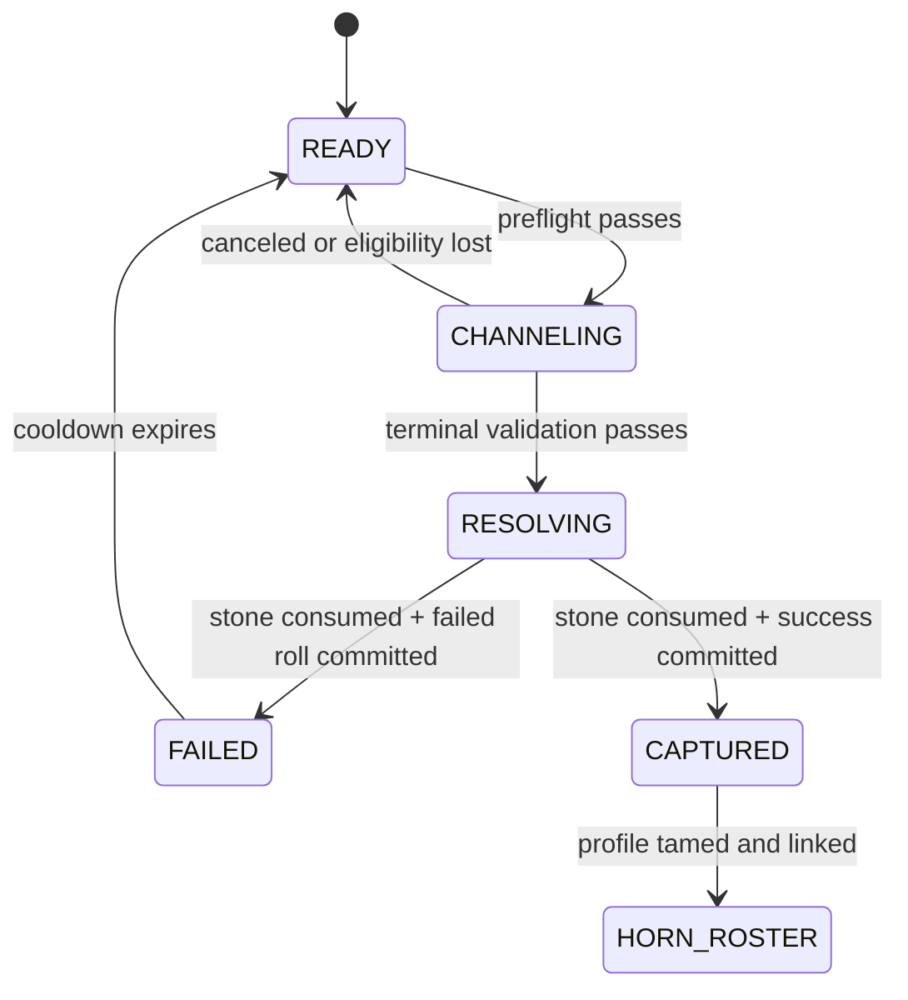

# Draconic Capture, Dragon Horn, and Revival Specification

Status: Proposed redesign; supersedes the unreleased bonded-stone implementation
Scope: Full-sized dragons, the shared Dragon Horn roster, active limits, timed summoning, and paid revival
Target dependency: Tamework `>=3.0.0 <4.0.0`

## 1. Purpose

Draconic Stones are consumable capture attempts, not storage containers. A player weakens and tranquilizes a wild dragon, channels a tiered stone, and spends that stone when Tamework resolves the capture roll. A successful roll tames the existing dragon and adds its canonical profile to the player's Dragon Horn. A failed roll spends the stone but leaves the dragon eligible for another attempt after the retry cooldown.

The Dragon Horn is the single interface for selecting, summoning, dismissing, commanding, locating, recalling, and reviving owned dragons. No dragon is stored inside a stone, and no filled, active, damaged, lost, or unavailable stone item state exists. When a summon lease ends, the live projection is durably despawned and the profile returns to roster-stored state.

Related specifications:

- [Soul Bond and Miniwyvern](soul-bond-miniwyvern.md)
- [Dragon content and encounters](dragon-content-encounters.md)
- [Plugin architecture](plugin-architecture.md)
- Tamework [capture policy](https://github.com/Alechilles/AlecsTamework/blob/main/docs/specs/hydragon/capture-policy.md)
- Tamework [command-roster capture and revival](https://github.com/Alechilles/AlecsTamework/blob/main/docs/specs/hydragon/command-roster-capture-revival.md)
- Tamework [population groups](https://github.com/Alechilles/AlecsTamework/blob/main/docs/specs/hydragon/population-groups.md)
- Tamework [integration contract](https://github.com/Alechilles/AlecsTamework/blob/main/docs/specs/hydragon/integration-contract.md)

## 2. Locked product decisions

- Every resolved, eligible capture roll consumes exactly one Draconic Stone, including a failed roll.
- Invalid targeting, failed preflight, interrupted channeling, or eligibility lost before the roll consumes no stone and obtains no random result.
- Higher-tier stones improve success probability. Low-tier stones are intentionally consumable resources that may take several attempts against powerful dragons.
- A successful capture tames and links the existing dragon in place. It does not despawn the dragon or create a filled stone.
- All owned full dragons and the player's Soul Bond Miniwyvern appear in the same Dragon Horn roster.
- The Dragon Horn is an access item, not the canonical save. Tamework owns the durable owner-and-command-family roster.
- The maximum number of active full dragons is configured through Tamework population groups rather than hardcoded command-item logic. HyDragon initially configures one active full dragon per owner.
- Each full dragon has a data-driven summon duration. Capture success, Horn Summon, and paid revival start a per-profile lease; expiry returns the profile to roster-stored state and releases its active slot.
- Recall, relocation, chunk unload, relog, and server restart do not reset or replenish a running summon lease.
- A dead dragon stays in the roster and uses a fully data-driven revival cost. A cost may require any item IDs, arbitrary positive quantities, and several different items together.
- Full dragon flight uses Tamework's Flightmaster's Talisman.
- The prior bonded-vessel system is removed in full. HyDragon has never shipped, so no migration, alias, adoption, or compatibility path is required.

## 3. Ownership boundary

| Layer | Owns |
| --- | --- |
| HyDragon | Stone and Dragon Horn assets, recipes, tier balance, role allowlists, capture feedback, role/group summon-duration and revival-cost configuration, dragon-specific localization and effects |
| Tamework | Eligibility and exactly-once roll, source-item consumption, tame/role/profile transaction, durable command-family roster, active-count admission, summon leases/storage, profile lifecycle, command UI/actions, paid revival transaction and recovery |
| Hytale runtime | Inventory and ECS primitives, world placement, NPC role/effect execution |

HyDragon must use Tamework's public, capability-gated contracts. It must not reproduce command links, profile identity, population counts, or revival state in a private second database.

## 4. Functional requirements

### Capture eligibility and tiers

- **HYD-CAP-001:** Draconic Stones MUST target only configured wild full-dragon roles. `Wyvern_Mini` and `Tamed_Wyvern_Mini` MUST be denied by every stone tier.
- **HYD-CAP-002:** A capture attempt MUST require a living target, an allowed
  wild role, valid range and line of interaction, and
  `Tw_Status_Tranquilized`. Draconic Stones do not impose a separate health
  threshold.
- **HYD-CAP-003:** HyDragon MUST ship Iron, Thorium, Cobalt, Adamantium, and Ancient/Mithril tiers with increasing capture power and Common, Uncommon, Rare, Epic, and Legendary item qualities respectively.
- **HYD-CAP-004:** Each target role MUST configure capture resistance, minimum eligible power, chance modifiers, and any special encounter requirements.
- **HYD-CAP-005:** Ancient/Mithril MUST guarantee capture after every
  non-probability requirement passes. It MUST NOT bypass tranquilizer, role,
  ownership, capacity, range, or encounter requirements.
- **HYD-CAP-006:** Tamework MUST perform one authoritative terminal roll. HyDragon MUST NOT pre-roll or retry entropy in callbacks.

### Stone consumption boundary

- **HYD-CAP-007:** Preflight denial, missing Dragon Horn, interrupted channeling, stale target, target death, lost range, lost tranquilizer, or any denial before durable roll resolution MUST consume nothing.
- **HYD-CAP-008:** The transition from an unrolled attempt to a resolved success or resolved failure is the gameplay-spend boundary. Exactly one source stone MUST be consumed for either result.
- **HYD-CAP-009:** Duplicate completion callbacks and restart recovery MUST return the recorded result without consuming another stone or obtaining another roll.
- **HYD-CAP-010:** A failed roll MUST leave the target alive, wild, untamed, unowned, and otherwise unchanged; apply the configured retry cooldown; and report that the stone was spent.
- **HYD-CAP-011:** If an inventory fault prevents the source stone from being consumed, the roll MUST NOT become externally final. Recovery MUST converge to either one consumed stone and one recorded result, or a canceled pre-roll attempt with no mutation. It MUST never grant a free resolved attempt.
- **HYD-CAP-011A:** If a successful result was charged but an internal fault makes tame/link terminally impossible, recovery MUST cancel prepared positive mutations and create one replacement-stone recovery claim. Ordinary failed rolls and player-caused invalidation after commitment are not refundable. Capture and refund MUST be mutually exclusive.

### Successful capture and Dragon Horn membership

- **HYD-CAP-012:** Success MUST preserve the target's canonical identity, tame and assign the configured tamed role, establish the owner, create or update exactly one Tamework profile, and add that profile to command family `hydragon:dragon_horn`.
- **HYD-CAP-013:** The live target MUST remain projected at its capture location after success. Capture MUST NOT use the ordinary captured-item despawn/filled-item finalizer.
- **HYD-CAP-014:** Capture preflight MUST require the player to hold at least one registered Dragon Horn access item in an inventory compartment Tamework can atomically validate. If none exists, no roll or consumption occurs and localized feedback explains how to acquire one.
- **HYD-CAP-015:** One or more physical Dragon Horn copies owned by the same player MUST expose the same authoritative roster. Destroying, dropping, replacing, or copying a horn MUST NOT delete, duplicate, transfer, or fork companion ownership.
- **HYD-CAP-016:** A non-owner holding another player's horn MUST see no transferable authority. The roster is resolved from the acting owner and command family, never trusted from copied item metadata alone.
- **HYD-CAP-017:** A committed capture that cannot immediately refresh the horn UI MUST remain linked durably and appear after retry, relog, restart, or receiving a replacement horn.

### Commands, placement, and population

- **HYD-CAP-018:** The Dragon Horn MUST expose supported Tamework commands and linked-panel actions for roster-stored, loaded, unloaded, lost, and dead dragons: Summon, Dismiss/Return to Horn, Follow, Hold, Idle/Wander, Defend, Aggressive, Attack Target, Clear Target, Move To, Locate, Recall, Set Home, Return Home, Unlink where policy permits, and Revive when dead.
- **HYD-CAP-019:** Recall, initial post-revival placement, and Soul Bond Miniwyvern projection MUST choose safe positions in front of the player. Behind-player recall placement is removed globally from the relevant Tamework defaults.
- **HYD-CAP-020:** Every full dragon MUST join `hydragon:full_dragons`, configured as unlimited owned and a data-driven `MaxActivePerOwner`. HyDragon's initial value is one, but neither plugin may hardcode that value. Capture, Summon, recall, cross-world transfer, lost recovery, and revival MUST use the same Tamework admission authority.
- **HYD-CAP-020A:** The Dragon Horn MUST show the owner's authoritative active count and configured limit for the selected dragon's population group, using `Unlimited` for zero. Summon and Revive actions that would exceed the cap MUST be visibly disabled with a localized explanation.
- **HYD-CAP-021:** A capacity denial MUST leave the profile and roster row intact and report why it cannot currently be projected.
- **HYD-CAP-022:** Avatar-flight dragons MUST require only `Tamework_Flightmasters_Talisman`. Ground mounts and ordinary follow/combat behavior remain available without it.

### Timed summoning and roster storage

- **HYD-CAP-022A:** Every full-dragon role MUST resolve a positive `ActiveDurationMs`. A zero/unlimited duration remains a generic Tamework option but MUST NOT be used for HyDragon full dragons in the initial release.
- **HYD-CAP-022B:** Capture success begins the captured dragon's first summon lease without replacing the live NPC. Horn Summon and successful paid revival begin later leases.
- **HYD-CAP-022C:** Each profile MUST have an independent durable session ID, remaining active duration, and storage/cooldown state. Owning several dragons MUST NOT merge or share their timers.
- **HYD-CAP-022D:** The timer MUST continue while the projection is loaded or durably unloaded during an active owner session. Recall, home travel, cross-world relocation, mounting, command changes, chunk unload, and UI reopen MUST preserve remaining time.
- **HYD-CAP-022E:** Owner logout MUST safely return configured full dragons to `ROSTER_STORED`, preserving the remaining time only for recovery of an interrupted storage transaction. The next admitted Summon starts a new full lease after cooldown. Server downtime MUST NOT consume stored or pending time.
- **HYD-CAP-022F:** At expiry, Tamework MUST durably snapshot the canonical profile, transition through `STORING`, despawn the live NPC exactly once, commit `ROSTER_STORED`, release the population active slot, and start the configured resummon cooldown.
- **HYD-CAP-022G:** Manual Dismiss/Return to Horn performs the same storage transaction and starts the same cooldown. It MUST NOT allow dismiss-and-resummon to reset the timer for free.
- **HYD-CAP-022H:** `ROSTER_STORED` is effectively captured but has no capture item. The Horn MUST show stored status, Summon availability, cooldown remaining, and the configured active duration.
- **HYD-CAP-022I:** A running lease MUST display remaining time in the Horn and give configurable warnings before expiry. Expiry must provide localized feedback even when automatic storage completes off-screen.
- **HYD-CAP-022J:** `ACTIVE`, durably `UNLOADED`, `RESTORING`, `STORING`, and any ambiguous projection state that could still contain a live dragon MUST retain an active population slot. Only durable `ROSTER_STORED`, `DEAD_REVIVABLE`, or permanent release frees it.
- **HYD-CAP-022K:** If storage cannot complete, the operation remains recoverable under the same ID, the slot remains occupied, and no second projection may be summoned. Restart recovery MUST converge to one live active projection or one roster-stored profile, never neither or both.

### Death and paid revival

- **HYD-CAP-023:** Death MUST preserve the exact profile and Dragon Horn roster row in `DEAD_REVIVABLE`; it MUST NOT create an item, damage a stone, unlink the dragon, or create a replacement profile.
- **HYD-CAP-024:** Revival cost MUST be role-scoped, data-driven, and item-agnostic. Each role resolves an ordered list of required `(ItemId, Quantity)` components; every component is required, quantities are positive, and different roles may use entirely different items and quantities. HyDragon may initially use `Revitalizing_Essence`, but Tamework MUST NOT hardcode it.
- **HYD-CAP-024A:** The Horn's Revive confirmation MUST clearly display every cost component with item icon, localized item name, required quantity, owned quantity, and shortage state. Confirm MUST be disabled when any component is missing.
- **HYD-CAP-025:** Tamework MUST validate ownership, dead state, command-family membership, population admission, safe placement, the snapshotted cost definition, and every exact inventory component before revival can commit.
- **HYD-CAP-026:** Successful revival MUST consume the configured cost exactly once, revive the same profile, and project it safely in front of the player. The configured gameplay cooldown for HyDragon revival is zero; a short technical click debounce may remain.
- **HYD-CAP-027:** If revival cannot commit, the dragon stays dead and visible in the roster. The player pays nothing unless a durable operation has reserved/consumed the cost and recovery can prove the corresponding revive result.
- **HYD-CAP-028:** Crash recovery MUST converge to exactly one of: no charge and no revival; one charge and one revival; or one durable refund/recovery claim when a charge occurred but revival is terminally impossible. It MUST never produce a free revive, double charge, duplicate profile, or duplicate projection.

### Removal and clean first release

- **HYD-CAP-029:** Remove all HyDragon filled, active, damaged, lost, and unavailable stone assets, recipes, localization, interactions, runtime services, tests, and configuration references.
- **HYD-CAP-030:** Remove stone-based summon, store, re-capture, durability, death damage, repair, and Revitalizing-Essence repair interaction behavior.
- **HYD-CAP-031:** Remove every HyDragon `Vessel` section and all use of Tamework bonded-vessel capabilities or APIs.
- **HYD-CAP-032:** Do not implement migration. Development worlds, filled stones, bonded records, Soul Bound Wyvern items, and other unreleased formats are disposable test data.

## 5. Stone tier data

| Tier | Power | Quality | Canonical item ID | Material treatment |
| --- | ---: | --- | --- | --- |
| Iron | 1 | Common | `Draconic_Stone` | Iron |
| Thorium | 2 | Uncommon | `Draconic_Stone_Thorium` | Thorium |
| Cobalt | 3 | Rare | `Draconic_Stone_Cobalt` | Cobalt |
| Adamantium | 4 | Epic | `Draconic_Stone_Adamantium` | Adamantium |
| Ancient | 5 | Legendary | `Draconic_Stone_Ancient` | Mithril/ancient metal |

Every tier uses the same world and icon scale but a distinct metal-matched texture and quality. Exact success curves remain asset data. The tier progression must be strictly more reliable against the same eligible target; Ancient is guaranteed.

## 6. Capture state machine


```mermaid
stateDiagram-v2
    [*] --> READY
    READY --> CHANNELING: preflight passes
    CHANNELING --> READY: canceled or eligibility lost
    CHANNELING --> RESOLVING: terminal validation passes
    RESOLVING --> FAILED: stone consumed + failed roll committed
    RESOLVING --> CAPTURED: stone consumed + success committed
    FAILED --> READY: cooldown expires
    CAPTURED --> HORN_ROSTER: profile tamed and linked
```

The stone is spent only on entry to `FAILED` or `CAPTURED`. `RESOLVING` is durable and idempotent; it is not a client-visible third outcome.

## 7. Transaction requirements

### Eligible failed roll

1. Revalidate target, player, source stack, Dragon Horn access, population authority, and exact config revisions.
2. Persist the attempt and all immutable formula inputs without rolling.
3. Fence the exact stone stack and target/profile revision.
4. Resolve one result and atomically claim the one-stone consumption operation.
5. Exact-CAS decrement the source stack by one.
6. Commit `FAILED_ROLL`, cooldown, and one feedback event.
7. Leave the target unchanged.

### Successful capture

1. Perform steps 1 through 5 above.
2. Prepare owner, profile, role, population, and `hydragon:dragon_horn` roster mutations under the same operation ID.
3. Tame and role-map the existing target on its owning world thread.
4. Commit the canonical profile and command-family membership.
5. Commit the attempt and emit one capture/link event.
6. Refresh Horn projections opportunistically; failure to refresh does not undo durable success.

After a recorded successful roll, a transient apply failure remains recoverable under the same operation ID. It must not roll again or consume another stone. A proven terminal internal apply failure creates one replacement-stone recovery claim and commits no capture.

## 8. Dragon Horn contract

HyDragon supplies one canonical command item:

```text
ItemId: HyDragon_Dragon_Horn
CommandConfigId: HyDragonDragonHorn
CommandFamilyId: hydragon:dragon_horn
RosterStorage: OwnerCommandFamily
MembershipMode: LinkedOnly
RequireOwner: true
RequireTamed: true
```

The physical item opens and operates the roster but is not its persistence authority. A replacement Horn reconstructs its visible rows from Tamework's owner-command-family membership. Item metadata may cache UI details but cannot grant membership, transfer ownership, suppress a canonical row, or reset a summon lease.

The current `HyDragon_Command_Whistle` ID is renamed directly because HyDragon is unreleased. No alias is required.

## 9. Active-limit and timed-summon configuration

The group cap remains in `TwPopulationGroupConfig`:

```json
{
  "GroupId": "hydragon:full_dragons",
  "Limits": {
    "MaxOwnedPerOwner": 0,
    "MaxActivePerOwner": 1,
    "Scope": "Global"
  }
}
```

Role-scoped summon behavior belongs to `TwCompanionConfig.Command.Summon`:

```json
{
  "Command": {
    "Summon": {
      "Enabled": true,
      "ActiveDurationMs": 600000,
      "ResummonCooldownMs": 300000,
      "AutoStoreOnOwnerLogout": true,
      "ExpiryWarningThresholdsMs": [60000, 30000, 10000]
    }
  }
}
```

The numbers illustrate schema only; HyDragon role assets own final balance. Explicit warning arrays replace inherited arrays. The lease and cooldown are per profile, while `MaxActivePerOwner` is enforced across the population group.

## 10. Revival configuration

Role-scoped HyDragon companion configuration declares:

```json
{
  "Command": {
    "Revive": {
      "Enabled": true,
      "GameplayCooldownMs": 0,
      "Costs": [
        { "ItemId": "Revitalizing_Essence", "Quantity": 2 },
        { "ItemId": "Draconic_Essence", "Quantity": 4 }
      ]
    }
  }
}
```

The example demonstrates a two-component AND cost, not final HyDragon balance. Each full-dragon and Miniwyvern role must resolve a non-empty cost. The same generic codec can later price animal revival in Life Essence or any other content-owned item. Parent/child inheritance follows Tamework's normal nested config contract; an explicit `Costs` array replaces the inherited array.

## 11. Player feedback and localization

Every player-facing key ships in `en-US`, `pt-BR`, `de-DE`, `fr-FR`, and `es-ES` with identical key and placeholder sets. Required outcomes include:

- invalid role, tranquilizer, range, ownership, capacity, or special condition;
- Dragon Horn required;
- channel interrupted without cost;
- failed roll and consumed stone;
- successful capture and Horn addition;
- retry cooldown remaining;
- active cap, stored state, Summon/Dismiss, lease time remaining, expiry warnings, and resummon cooldown;
- dead/revival cost with every component, insufficient materials, and per-component shortage;
- revival placement, capacity, persistence, and recovery-pending failures.

Asset IDs remain canonical English in every locale.

## 12. Implementation removal map

| Remove | Replace with |
| --- | --- |
| `Vessel` blocks in all five stone spawner configs | `SourceConsumption: ResolvedAttempt`, `SuccessDisposition: TameAndCommandLink`, and Dragon Horn command-family fields |
| Filled/active/damaged/lost/unavailable stone item states | No replacement; empty tier item is consumed |
| Bonded stone repair interaction and journal | Tamework command revival cost transaction |
| Stone summon/store/re-capture flow | Dragon Horn Summon/Dismiss, timed roster storage, Recall, and persistent roster |
| `Soul_Bound_Wyvern` item | Wyvern Egg claim adds Miniwyvern to Dragon Horn |
| `HyDragon_Command_Whistle` | `HyDragon_Dragon_Horn` |
| HyDragon bonded-vessel capability checks | Tamework capture-policy, command-roster, provisioning, population, and paid-revival capability checks |

## 13. Acceptance criteria

- Invalid targeting and interrupted channels consume no stone and obtain no roll.
- A seeded eligible failed roll consumes exactly one stone, leaves the dragon wild and unchanged, and applies one cooldown.
- A seeded success consumes exactly one stone, tames the same entity/profile, leaves it in the world, and adds one Horn roster row.
- Duplicate completion and restart recovery obtain one result and consume one stone total.
- Multiple low-tier attempts can each consume a stone before success; higher tiers produce strictly higher configured chance for the same target and conditions.
- Ancient captures every eligible supported role but cannot bypass deterministic requirements.
- Capture is denied without a Dragon Horn and consumes nothing.
- Losing or replacing a Horn does not lose a roster; another player's Horn grants no access.
- One Horn controls all owned full dragons and the one Miniwyvern while preserving their distinct configurable population-group limits.
- At `MaxActivePerOwner: 1`, a second full-dragon capture, Summon, revival, or recovery that would project another dragon is denied before positive mutation. Raising the configured value admits exactly that many concurrent active profiles.
- Capture success starts one lease. Recall, relog, chunk unload, cross-world travel, UI reopen, and repeated commands never reset its remaining time.
- Lease expiry and manual Dismiss each produce one `ROSTER_STORED` profile, one despawn, one released active slot, and one cooldown. Summon after cooldown starts one fresh lease.
- Restart during warning, expiry, storage, or summon recovery preserves the exact profile and converges without duplicate projection or timer reset.
- The Horn clearly displays stored/active/dead state, remaining summon time, cooldown, and every revival cost component with owned/required quantities.
- Recall and revival place companions safely in front of the player.
- Death leaves one dead roster row. Successful revival consumes every configured cost component once, restores the same profile once, and starts one summon lease.
- Insufficient materials, capacity denial, unsafe placement, missing capability, and persistence unavailability cause no charge and no revival.
- A multi-component revival cost can mix arbitrary item IDs and quantities; missing any one component disables confirmation and consumes nothing.
- Restart at every capture and revival checkpoint converges without duplicate profiles, projections, charges, refunds, or free rolls; a terminal charged capture fault produces one replacement claim and no capture.
- The packaged mod contains no bonded-stone item states, runtime paths, config sections, migration readers, or `Soul_Bound_Wyvern` item.

## 14. Delivery order

1. Tamework command-family roster authority and public capability.
2. Tamework capture `ResolvedAttempt` consumption and `TameAndCommandLink` success disposition.
3. Tamework configurable active caps, timed Summon/Dismiss/storage, and recovery.
4. Tamework generic multi-component paid revival and recovery.
5. HyDragon Dragon Horn item/config/localization.
6. HyDragon stone config conversion and bonded-state removal.
7. Miniwyvern Egg-to-Horn claim conversion.
8. Cross-repository unit, integration, packaged-asset, restart, and in-game acceptance tests.
