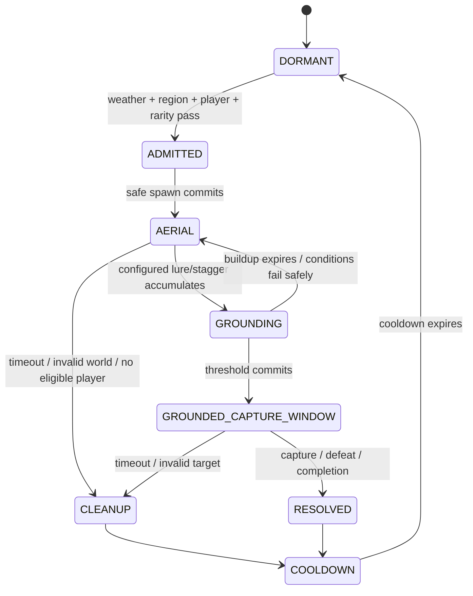

# Dragon Content, Crafting, Spawning, and Encounter Specification

Status: Draft implementation contract
Base-game evidence target: Hytale Workshop corpus `0.5.6`

## 1. Purpose and boundaries

This specification completes HyDragon's content layer and separates ordinary asset-driven content from encounters that require Java orchestration. It covers materials, the Draconic Altar, recipes, the current dragon roster, difficulty metadata, static spawning, mounts, and special multi-stage encounters.

Capture/vessel mechanics are defined in [Capture, summoning, and maintenance](capture-summoning-maintenance.md). Miniwyvern content is defined in [Soul Bond and Miniwyvern](soul-bond-miniwyvern.md). Runtime boundaries follow [Plugin architecture](plugin-architecture.md) and the Tamework [integration contract](https://github.com/Alechilles/AlecsTamework/blob/main/docs/specs/hydragon/integration-contract.md).

## 2. Base-game asset boundary

The Hytale Workshop `0.5.6` schema is the evidence for this split:

- `CraftingRecipe` supports `Input`, `Output`, `BenchRequirement`, and `TimeSeconds`. The Draconic Altar and its recipes are therefore asset/config work.
- `WorldNPCSpawn` supports weighted NPC entries, `Environments`, `DayTimeRange`, `MoonPhaseRange`, `LightRanges`, and `MoonPhaseWeightModifiers`. Ordinary biome/region/time/light/moon/rarity spawning is asset/config work.
- `BeaconNPCSpawn` adds player-distance, `YRange`, spawn cooldown/radius, and state controls. It can support localized height- or proximity-based spawning, but its `0.5.6` schema does not express weather or an owned-companion prerequisite.
- Weather gates, checking whether a player owns/uses another flying dragon, and a multi-phase aerial-to-ground capture sequence therefore require the HyDragon plugin.

The plugin must not replace static spawning or crafting that these schemas already express.

## 3. Requirements

### Materials and crafting

- **HYD-CONT-001:** HyDragon MUST ship Draconic Essence, Draconic Scale, Revitalizing Essence, and seven elemental essence semantics: Fire, Ice, Water, Nature, Lightning, Wind, and Void.
- **HYD-CONT-002:** Existing public item IDs MUST be preserved where practical: `Draconic_Essence_Igne` maps to Fire, `Draconic_Essence_Cryo` maps to Ice, and `Draconic_Essence_Storm` maps to Lightning. Water, Wind, generic Draconic Essence, and Revitalizing Essence require new canonical items.
- **HYD-CONT-003:** Full-dragon drop lists MUST provide configured sources for Draconic Scale, generic Draconic Essence, and applicable elemental essences. Drop chance and quantity MUST be balance data per species/difficulty.
- **HYD-CONT-004:** HyDragon MUST add a placeable Draconic Altar crafting bench with dedicated categories and localized presentation. Draconic Stones, Revitalizing Essence, and Draconic Soul Bond MUST require that altar rather than `Arcanebench`.
- **HYD-CONT-005:** The altar MUST provide recipes for all five stone tiers, Revitalizing Essence, and Draconic Soul Bond. Stone recipes MUST use the corresponding Iron, Thorium, Cobalt, Adamantium, or Mithril/Ancient material plus configured draconic ingredients.

### Dragon roster and behavior

- **HYD-CONT-006:** The v1 full-dragon roster MUST include Hydra, Nordic Drake, and Rock Drake tiers T1/T2/T3. Miniwyvern is a separate Soul Bond companion, not a full-dragon encounter or capture role.
- **HYD-CONT-007:** Every full-dragon species/difficulty MUST declare stable role IDs, tamed-role mapping, stats, behavior package, rarity, spawn definition, capture resistance, minimum stone tier, mount mode, drops, and special eligibility requirements.
- **HYD-CONT-008:** Every full dragon intended for capture MUST have a complete tamed role exposing supported Tamework follow/hold/defend/attack/recall/home commands. No wild role may enter a capture allowlist without a validated tamed-role mapping.
- **HYD-CONT-009:** Each species MUST explicitly select `NONE`, `GROUND`, or `AVATAR_FLIGHT` mount mode. Hydra and suitable Rock Drakes SHOULD provide ground mounting; Nordic Drake MUST retain its validated `TameworkAvatarFlight` integration.
- **HYD-CONT-010:** Avatar flight MUST use Tamework's Flightmaster's Talisman exclusively. HyDragon MUST NOT declare or document another flight mod dependency.

### Spawning and special encounters

- **HYD-CONT-011:** Ordinary spawns MUST use `WorldNPCSpawn`/`BeaconNPCSpawn` assets for supported environment, weight, time, moon, light, altitude/proximity, radius, cooldown, and state conditions.
- **HYD-CONT-012:** Weather gates, player progression/ownership gates, random rare-event admission, and multi-stage behavior MUST use plugin-controlled encounter definitions rather than undocumented spawn-asset fields.
- **HYD-CONT-013:** HyDragon MUST support a special high-altitude encounter whose admission verifies the eligible player has an active, rideable avatar-flight dragon and access to Tamework's Flightmaster's Talisman.
- **HYD-CONT-014:** The high-altitude encounter MUST begin as an aerial confrontation, require a configured lure/stagger sequence before the target becomes grounded, and open capture eligibility only after the grounded condition is authoritative.
- **HYD-CONT-015:** Plugin-controlled encounters MUST enforce per-region/global concurrency, player-safe placement, deterministic ownership/credit, cleanup, retry cooldown, and restart reconciliation without duplicating or silently deleting a target.
- **HYD-CONT-016:** Content assets, domain configs, migrations, and all static/dynamic spawn paths MUST pass schema/reference validation and the acceptance criteria in section 12 before release.

## 4. Content inventory and target state

| Content | Current state | Target work |
| --- | --- | --- |
| Hydra | Wild/tamed roles, combat, drops, capture mapping, glacial daytime spawn | Fix mount declaration/config mismatch; add species metadata and complete drop economy |
| Nordic Drake | Wild/tamed roles, combat, capture mapping, avatar-flight config | Add ordinary or special spawn path; validate flight in game; add species metadata |
| Rock Drake T1/T2/T3 | Wild tiers, combat, cave spawn patches | Add tamed mappings, capture declarations, commands, mount policy, and tier metadata |
| Miniwyvern | Wild/tamed roles and basic feed/follow assets, no world spawn, incorrectly capturable | Remove ordinary capture; keep production wild spawning disabled; implement Soul Bond lifecycle/archetypes |
| Draconic Stone | One recipe at `Arcanebench` | Treat existing ID as Iron; add four tiers and altar-only recipes |
| Essences | Cryo, Igne, Nature, Storm, Void assets; current dragon drops primarily source Cryo/Nature | Add generic, Water, Wind, Revitalizing; normalize names and add configured drop sources for the full set |
| Draconic Scale | Item and some drops | Retain; tune per-species sourcing |
| Draconic Altar | Missing | Add bench block/model/icon/categories/recipes/localization |

## 5. Material and item identity

### Canonical semantic map

| Semantic ID | Player-facing name | Item ID | Migration rule |
| --- | --- | --- | --- |
| `draconic` | Draconic Essence | `Draconic_Essence` | New |
| `scale` | Draconic Scale | `Draconic_Scale` | Preserve |
| `fire` | Fire Essence | `Draconic_Essence_Igne` | Preserve existing ID; update translations consistently |
| `ice` | Ice Essence | `Draconic_Essence_Cryo` | Preserve existing ID; update translations consistently |
| `water` | Water Essence | `Draconic_Essence_Water` | New |
| `nature` | Nature Essence | `Draconic_Essence_Nature` | Preserve |
| `lightning` | Lightning Essence | `Draconic_Essence_Storm` | Preserve existing ID as compatibility identity |
| `wind` | Wind Essence | `Draconic_Essence_Wind` | New |
| `void` | Void Essence | `Draconic_Essence_Void` | Preserve |
| `revitalizing` | Revitalizing Essence | `Revitalizing_Essence` | New |

Semantic IDs insulate Java/config logic from older flavor names. New recipes and archetype definitions reference semantic IDs through validated config; item interactions resolve them to canonical item IDs.

Existing inventory items must remain usable. Do not add duplicate Fire/Ice/Lightning items solely to match English terminology.

## 6. Draconic Altar

### Asset/config work

The altar is a normal custom crafting bench using the Hytale `CraftingRecipe` contract:

- placeable block/item, model, icon, textures, particles/audio, collision, and localization;
- stable bench ID `Draconic_Altar`;
- dedicated recipe category IDs for Stones, Bonding, and Restoration;
- recipes whose `BenchRequirement` targets `Draconic_Altar`;
- recipe `Input`, `Output`, and `TimeSeconds` values owned by assets.

No Java UI or ritual controller is required for v1. A future animated ritual is presentation only unless it introduces new transactional behavior.

### Recipe families

| Output | Required recipe identity | Balance freedom |
| --- | --- | --- |
| Iron Draconic Stone | Iron + scale/essence ingredients | Quantities/time data-driven |
| Thorium Draconic Stone | Thorium + stronger draconic ingredients | Quantities/time data-driven |
| Cobalt Draconic Stone | Cobalt + stronger draconic ingredients | Quantities/time data-driven |
| Adamantium Draconic Stone | Adamantium + rare draconic ingredients | Quantities/time data-driven |
| Ancient Draconic Stone | Mithril/ancient material + endgame draconic ingredients | Quantities/time data-driven |
| Revitalizing Essence | Draconic and restorative ingredients | Quantity/time data-driven |
| Draconic Soul Bond | Rare draconic + elemental/bonding ingredients | Once-per-player enforced on use, not by crafting |

Recipe validation must ensure the current `Draconic_Stone` no longer lists `Arcanebench` after the altar ships.

## 7. Dragon species definition

Each `Server/HyDragon/DragonSpecies/<id>.json` record uses the following semantic model:

```text
Id
WildRoleIds[]
TamedRoleIdByWildRole{}
DifficultyId
StatsAndBehaviorAssetIds
DropListId
Mount:
  mode                 NONE | GROUND | AVATAR_FLIGHT
  avatarFlightConfigId nullable
Capture:
  resistance
  minimumStoneTier
  maxHealthPercentOverride nullable
  specialRequirementIds[]
Spawn:
  ordinarySpawnAssetIds[]
  pluginEncounterIds[]
Presentation:
  localizationPrefix
  model/appearance IDs
```

This is HyDragon domain data. Generic capture math and population enforcement are delegated to the linked Tamework specifications.

Unknown roles, missing tamed mappings, invalid mount configs, unknown item/effect/projectile IDs, and duplicate species ownership of one wild role are load errors for that species. The plugin disables only invalid species runtime features and reports the exact reference.

## 8. Ordinary spawn plan

Use asset spawning wherever possible:

| Species | Initial ordinary spawn target | Asset mechanism |
| --- | --- | --- |
| Hydra | Zone 3 glacial environment, configured daytime/rarity | Preserve and normalize existing `WorldNPCSpawn` asset |
| Rock Drake T1 | Zone 1 cave forests | Preserve current patch/weighted spawn |
| Rock Drake T2 | Zone 2 volcanic caves | Preserve current patch/weighted spawn |
| Rock Drake T3 | Zone 2 volcanic and Zone 3 glacial caves | Preserve current patches/weights |
| Nordic Drake | Rare high-altitude/cold ordinary spawn only if it does not conflict with its special encounter | New `WorldNPCSpawn` or `BeaconNPCSpawn` definition |
| Miniwyvern | None | Soul Bond only |

Spawn assets may vary weight by difficulty/rarity and supported moon/light conditions. Do not create a Java polling spawner for conditions already represented by `WorldNPCSpawn` or `BeaconNPCSpawn`.

## 9. Plugin-controlled encounter model

`Server/HyDragon/Encounters/*.json` describes only requirements outside the `0.5.6` spawn schemas:

```text
Id
Enabled
TargetSpeciesId
RegionsAndAltitude
WeatherPredicate
TimePredicate                 optional; prefer spawn assets for ordinary cases
PlayerEligibility:
  activeCompanionGroup
  requiredMountMode
  requiredItemId
Admission:
  chance
  evaluationCooldown
  perRegionLimit
  globalLimit
Phases[]
Grounding:
  buildupSourceIds
  threshold
  groundedState/effect
  captureWindowSeconds
CleanupAndCooldown
```

### Encounter lifecycle



Capture attempts during `AERIAL` or `GROUNDING` fail the named special eligibility requirement before a random roll. On `GROUNDED_CAPTURE_WINDOW`, ordinary health/tranquilizer/tier requirements still apply; grounding does not guarantee capture.

### High-altitude encounter eligibility

At admission time, at least one credited player must:

- own the active companion profile used for access;
- have an active companion in `hydragon:full_dragons` whose species declares `AVATAR_FLIGHT`;
- possess/access Tamework's Flightmaster's Talisman under the current avatar-flight contract;
- be in the configured world/region/altitude envelope and satisfy encounter cooldown.

Eligibility is rechecked before spawn and at critical phase transitions. Losing temporary eligibility does not instantly delete the target; the encounter definition supplies a grace/cleanup policy.

## 10. Mount and flight content

The species definition determines mounting; role assets implement it:

- `GROUND`: configure mountable role, anchor, animation, collision, and movement behavior.
- `AVATAR_FLIGHT`: configure `MountMode: TameworkAvatarFlight`, a valid Tamework avatar-flight config, model/camera offsets, animations, rider visual, VFX, and audio.
- `NONE`: do not expose a Mount interaction.

The existing Hydra interaction currently exposes Mount while the tamed role is not mountable. Release validation must resolve that mismatch by completing ground mounting or removing the interaction. The current Nordic Drake avatar-flight integration remains the reference and must be tested with the Flightmaster's Talisman.

## 11. Failure safety and persistence

- Encounter admission is serialized per region key and rechecks limits immediately before spawning.
- A spawned special target receives one encounter ID. Restart recovery reattaches to that target when possible; it does not spawn a replacement until absence is authoritative.
- If state is ambiguous, the encounter enters cleanup/reconciliation and blocks another admission in that region.
- Despawn/cleanup must not remove a dragon after Tamework has committed its capture.
- Capture and encounter completion events are idempotent by encounter ID and Tamework operation/profile ID.
- Invalid weather/player-service data fails closed for dynamic encounters without affecting ordinary spawn assets.
- Config reload never mutates an active encounter definition in place. Existing instances finish using an immutable snapshot or enter a documented safe cleanup state.

## 12. Acceptance criteria

- Asset validation finds every required item, icon/model, recipe input, drop reference, species role, tamed mapping, effect, projectile, and localization key.
- Only the Draconic Altar lists recipes for the five stones, Revitalizing Essence, and Soul Bond after migration; crafting consumes/produces the configured quantities once.
- Existing Igne, Cryo, Nature, Storm, and Void inventory remains valid while all seven player-facing elemental semantics are available.
- Hydra and each Rock Drake tier spawn only in their configured supported ordinary conditions; Nordic's selected spawn/encounter path is discoverable; Miniwyvern never appears through production spawning.
- Every capture-eligible wild role resolves to one valid tamed role and species capture record.
- Ground mounts do not require the Flightmaster's Talisman; every avatar-flight mount does, and no external flight-mod item is queried.
- `WorldNPCSpawn`/`BeaconNPCSpawn` tests cover environment/weight/time/moon/light/altitude/proximity fields without plugin duplication.
- Dynamic tests cover weather false/true, no flying dragon, wrong mount type, missing talisman, concurrency limit, unsafe placement, restart in every phase, and config reload mid-encounter.
- The aerial target cannot be captured before the grounded phase; grounding retains health/tranquilizer/minimum-tier requirements.
- Capture at the cleanup boundary produces one captured profile and no subsequent encounter despawn or replacement.

## 13. Current-state migration

1. Add missing item assets and semantic mappings without renaming existing IDs.
2. Add the Draconic Altar and move the current stone recipe off `Arcanebench` only when the altar is available in the same release.
3. Normalize existing Hydra/Rock spawn patches into the documented species records while preserving intended weights/conditions.
4. Add tamed Rock Drake roles before adding them to capture configs.
5. Choose and implement Nordic Drake's ordinary versus special spawn coverage; avoid duplicate paths unless explicitly balanced.
6. Remove Miniwyvern from capture configs and all production spawn tables before enabling Soul Bond.
7. Resolve Hydra's Mount interaction/role mismatch.
8. Preserve Tamework's Nordic flight integration and delete stale documentation or metadata describing another flight dependency.

No migration may delete unknown player items, profiles, or live entities. Broken references are disabled and reported.

## 14. Phased dependencies

| Phase | Asset/config work | Plugin/runtime work | Dependency |
| --- | --- | --- | --- |
| D0 | Material semantics, missing items, localization | Config validation | [Plugin architecture](plugin-architecture.md) A0-A2 |
| D1 | Draconic Altar and recipes | None beyond validation | Hytale `CraftingRecipe` 0.5.6 contract |
| D2 | Complete tamed roles, commands, drops, ordinary spawns | Species repository | Tamework 3.0.0 and [capture policy](https://github.com/Alechilles/AlecsTamework/blob/main/docs/specs/hydragon/capture-policy.md) |
| D3 | Ground/avatar-flight content and verification | Talisman capability/status messaging | Tamework avatar flight |
| D4 | Special encounter assets/effects | Encounter admission/state machine/recovery | Tamework [integration contract](https://github.com/Alechilles/AlecsTamework/blob/main/docs/specs/hydragon/integration-contract.md) |
| D5 | Balance and polish | Telemetry/diagnostics-driven tuning | D0-D4 |
