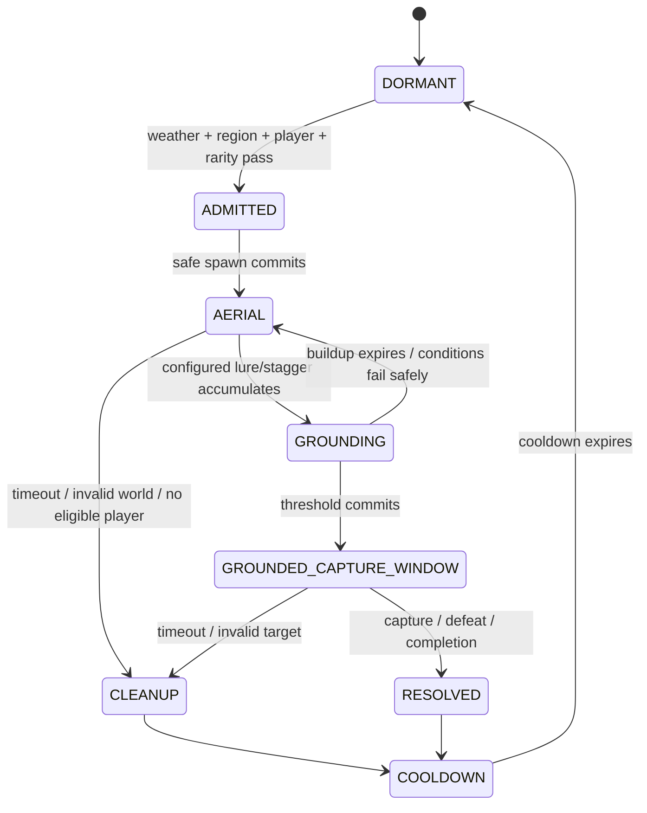

# Dragon Content, Crafting, Spawning, and Encounter Specification

Status: Implementation complete; release verification pending
Base-game evidence target: Hytale Workshop corpus `0.5.6`

## 1. Purpose and boundaries

This specification completes HyDragon's content layer and separates ordinary asset-driven content from encounters that require Java orchestration. It covers materials, the Draconic Altar, recipes, the current dragon roster, difficulty metadata, static spawning, mounts, and special multi-stage encounters.

Capture/vessel mechanics are defined in [Capture, summoning, and maintenance](capture-summoning-maintenance.md). Miniwyvern content is defined in [Soul Bond and Miniwyvern](soul-bond-miniwyvern.md). Runtime boundaries follow [Plugin architecture](plugin-architecture.md) and the Tamework [integration contract](https://github.com/Alechilles/AlecsTamework/blob/main/docs/specs/hydragon/integration-contract.md).

## 2. Base-game asset boundary

The Hytale Workshop `0.5.6` schema is the evidence for this split:

- `CraftingRecipe` supports `Input`, `Output`, `BenchRequirement`, and `TimeSeconds`. The Draconic Altar and its recipes are therefore asset/config work.
- `WorldNPCSpawn` supports weighted NPC entries, `Environments`, `DayTimeRange`, `MoonPhaseRange`, `LightRanges`, and `MoonPhaseWeightModifiers`. Ordinary biome/region/time/light/moon/rarity spawning is asset/config work.
- `BeaconNPCSpawn` adds player-distance, `YRange`, spawn cooldown/radius, and state controls. It can support localized height- or proximity-based spawning, but its `0.5.6` schema does not express weather or an owned-companion prerequisite.
- Weather gates, checking whether a player owns/uses another flying dragon, and a multi-phase aerial-to-ground capture sequence therefore require the HyDragon plugin.

The plugin must not replace static spawning or crafting that these schemas already express.

## 3. Requirements

### Materials and crafting

- **HYD-CONT-001:** HyDragon MUST ship Draconic Essence, Draconic Scale, Revitalizing Essence, and seven elemental essence semantics: Fire, Ice, Water, Nature, Lightning, Wind, and Void.
- **HYD-CONT-002:** Every canonical HyDragon asset ID and asset filename MUST use clear English terminology. The canonical IDs are `Draconic_Essence_Fire`, `Draconic_Essence_Ice`, and `Draconic_Essence_Lightning`; the removed development IDs `Draconic_Essence_Igne`, `Draconic_Essence_Cryo`, and `Draconic_Essence_Storm` MUST remain absent from assets and references. HyDragon MUST NOT ship aliases, compatibility shims, or persisted-item conversion code for those unreleased IDs.
- **HYD-CONT-003:** Full-dragon drop lists MUST provide configured sources for Draconic Scale, generic Draconic Essence, and applicable elemental essences. Drop chance and quantity MUST be balance data per species/difficulty.
- **HYD-CONT-004:** HyDragon MUST add a placeable Draconic Altar crafting bench with dedicated categories and localized presentation. Draconic Stones, Revitalizing Essence, and Draconic Soul Bond MUST require that altar rather than `Arcanebench`.
- **HYD-CONT-005:** The altar MUST provide recipes for all five stone tiers, Revitalizing Essence, and Draconic Soul Bond. Stone recipes MUST use the corresponding Iron, Thorium, Cobalt, Adamantium, or Mithril/Ancient material plus configured draconic ingredients.

### Dragon roster and behavior

- **HYD-CONT-006:** The v1 full-dragon roster MUST include Hydra, Nordic Drake, and Rock Drake tiers T1/T2/T3. Miniwyvern is a separate Soul Bond companion, not a full-dragon encounter or capture role.
- **HYD-CONT-007:** Every full-dragon species/difficulty MUST declare stable role IDs, tamed-role mapping, stats, behavior package, rarity, spawn definition, capture resistance, minimum stone tier, mount mode, drops, and special eligibility requirements.
- **HYD-CONT-008:** Every full dragon intended for capture MUST have a complete tamed role exposing supported Tamework follow/hold/defend/attack/recall/home commands. No wild role may enter a capture allowlist without a validated tamed-role mapping.
- **HYD-CONT-009:** Each species MUST explicitly select `NONE`, `GROUND`, or `AVATAR_FLIGHT` mount mode. Hydra and suitable Rock Drakes SHOULD provide ground mounting; Nordic Drake MUST retain its validated `TameworkAvatarFlight` integration.
- **HYD-CONT-010:** Avatar flight MUST use Tamework's Flightmaster's Talisman exclusively. HyDragon MUST NOT declare or document another flight mod dependency.

### Spawning and special encounters

- **HYD-CONT-011:** Ordinary spawns MUST use `WorldNPCSpawn`/`BeaconNPCSpawn` assets for supported environment, weight, time, moon, light, altitude/proximity, radius, cooldown, and state conditions.
- **HYD-CONT-012:** Weather gates, player progression/ownership gates, random rare-event admission, and multi-stage behavior MUST use plugin-controlled encounter definitions rather than undocumented spawn-asset fields.
- **HYD-CONT-013:** HyDragon MUST support a special high-altitude encounter whose admission verifies the eligible player has an active, rideable avatar-flight dragon and access to Tamework's Flightmaster's Talisman.
- **HYD-CONT-014:** The high-altitude encounter MUST begin as an aerial confrontation, require a configured lure/stagger sequence before the target becomes grounded, and open capture eligibility only after the grounded condition is authoritative.
- **HYD-CONT-015:** Plugin-controlled encounters MUST enforce per-region/global concurrency, player-safe placement, deterministic ownership/credit, cleanup, retry cooldown, and restart reconciliation without duplicating or silently deleting a target.
- **HYD-CONT-016:** Content assets, domain configs, and all static/dynamic spawn paths MUST pass schema/reference validation and the acceptance criteria in section 12 before release.

### Localization and naming

- **HYD-CONT-017:** Every player-facing HyDragon localization key MUST ship in `Server/Languages/en-US/server.lang`, `pt-BR/server.lang`, `de-DE/server.lang`, `fr-FR/server.lang`, and `es-ES/server.lang`. English is the complete default catalog; the other four catalogs MUST contain the same keys with human-reviewed translations and matching placeholders.

## 4. Implemented content inventory

| Content | Implemented state | Release verification focus |
| --- | --- | --- |
| Hydra | Wild/tamed roles, species data, combat, drops, capture mapping, ordinary spawn, and ground-mount policy | Mount behavior, drop balance, and spawn conditions in game |
| Nordic Drake | Wild/tamed roles, species data, combat, capture mapping, encounter coverage, and `TameworkAvatarFlight` config | Avatar flight using only Tamework's Flightmaster's Talisman |
| Rock Drake T1/T2/T3 | Wild/tamed roles, capture declarations, commands, cave spawning, mount policy, and tier metadata | Tier balance, commands, spawning, and mounting in game |
| Miniwyvern | Soul Bond provisioning, seven archetypes, production wild spawning disabled, and ordinary capture denied | Once-only entitlement, population limits, and ability safety |
| Draconic Stones | Iron, Thorium, Cobalt, Adamantium, and Ancient tiers with altar-only recipes | Tier eligibility, probability, vessel lifecycle, repair, and cooldown |
| Essences | Generic, Fire, Ice, Water, Nature, Lightning, Wind, Void, and Revitalizing canonical items and configured sources | Drop balance, crafting, references, and localization parity |
| Draconic Scale | Canonical item and configured dragon drops | Per-species sourcing and balance |
| Draconic Altar | Bench block, model, icon, categories, recipes, and five locale catalogs | Placement, recipe availability, and packaged references |

## 5. Material and item identity

### 5.1 Canonical English semantic map

| Semantic ID | Player-facing name | Item ID | Implemented asset status |
| --- | --- | --- | --- |
| `draconic` | Draconic Essence | `Draconic_Essence` | Canonical item present |
| `scale` | Draconic Scale | `Draconic_Scale` | Canonical item retained |
| `fire` | Fire Essence | `Draconic_Essence_Fire` | Canonical English item replaces the removed Igne development ID |
| `ice` | Ice Essence | `Draconic_Essence_Ice` | Canonical English item replaces the removed Cryo development ID |
| `water` | Water Essence | `Draconic_Essence_Water` | Canonical item present |
| `nature` | Nature Essence | `Draconic_Essence_Nature` | Canonical item retained |
| `lightning` | Lightning Essence | `Draconic_Essence_Lightning` | Canonical English item replaces the removed Storm development ID |
| `wind` | Wind Essence | `Draconic_Essence_Wind` | Canonical item present |
| `void` | Void Essence | `Draconic_Essence_Void` | Canonical item retained |
| `revitalizing` | Revitalizing Essence | `Revitalizing_Essence` | Canonical item present |

Semantic IDs insulate Java/config logic from asset filenames. Recipes and archetype definitions reference semantic IDs through validated config; item interactions resolve them only to the canonical English item IDs.

### 5.2 English identifier policy and completed pre-release cleanup

Canonical asset IDs, JSON filenames, model/texture/icon filenames, config IDs, localization-key ID segments, and references MUST use English descriptive terms. Proper nouns such as Hydra and Nordic Drake, stable Tamework IDs, and engine-defined schema/type names are not translations and remain unchanged.

Three untranslated or semantically mismatched development IDs were renamed directly before release:

| Removed development ID | Canonical English ID |
| --- | --- |
| `Draconic_Essence_Igne` | `Draconic_Essence_Fire` |
| `Draconic_Essence_Cryo` | `Draconic_Essence_Ice` |
| `Draconic_Essence_Storm` | `Draconic_Essence_Lightning` |

Recipes, drops, item assets, icons, textures, models, projectile references, Tamework/HyDragon configs, localization keys, and tests now reference the canonical English IDs. The validator treats any return of a replaced identifier as a release error.

HyDragon has never been released, so there are no supported player inventories, profiles, worlds, or public API consumers containing these IDs. There are zero HyDragon migration or legacy-compatibility concerns: the first release includes no alias registry, compatibility items, old localization keys, persisted-item conversion, or other runtime upgrade path for them.

The repository validator scans asset filenames and identifier-bearing JSON/string fields. Any untranslated replaced identifier fails release validation.

Revision note (2026-07-21): this replaces the earlier `HYD-CONT-002` compatibility policy. Because HyDragon has never been released, the incorrect source IDs are renamed directly and receive no runtime compatibility layer.

### 5.3 Localization catalogs

HyDragon ships these complete server catalogs:

| Locale | Language | Required path |
| --- | --- | --- |
| `en-US` | English (default/source) | `Server/Languages/en-US/server.lang` |
| `pt-BR` | Brazilian Portuguese | `Server/Languages/pt-BR/server.lang` |
| `de-DE` | German | `Server/Languages/de-DE/server.lang` |
| `fr-FR` | French | `Server/Languages/fr-FR/server.lang` |
| `es-ES` | Spanish | `Server/Languages/es-ES/server.lang` |

Every catalog contains the same key set for items, item descriptions, NPC/role names, the Draconic Altar and categories, interaction prompts, validation/failure reasons, cooldown/repair status, Soul Bond, archetypes/abilities, and player-visible encounter messages. Required locales MUST NOT rely on English fallback for a missing HyDragon key.

Files are UTF-8, preserve interpolation placeholders/markup exactly across locales, and use canonical English ID segments in keys—for example, each file defines `items.Draconic_Essence_Fire.name`, while an item asset references `server.items.Draconic_Essence_Fire.name`. Translation changes values, never asset IDs or localization keys.

CI compares all four translated key sets with `en-US`, rejects missing/extra/duplicate keys, validates placeholder parity, and flags untranslated English values except allowlisted proper nouns or intentionally language-neutral terms.

## 6. Draconic Altar

### Asset/config work

The altar is a normal custom crafting bench using the Hytale `CraftingRecipe` contract:

- placeable block/item, model, icon, textures, particles/audio, collision, and localization;
- stable bench ID `Draconic_Altar`;
- dedicated recipe category IDs for Stones, Bonding, and Restoration;
- recipes whose `BenchRequirement` targets `Draconic_Altar`;
- recipe `Input`, `Output`, and `TimeSeconds` values owned by assets.

No Java UI or ritual controller is required for v1. A future animated ritual is presentation only unless it introduces new transactional behavior.

### Recipe families

| Output | Required recipe identity | Balance freedom |
| --- | --- | --- |
| Iron Draconic Stone | Iron + scale/essence ingredients | Quantities/time data-driven |
| Thorium Draconic Stone | Thorium + stronger draconic ingredients | Quantities/time data-driven |
| Cobalt Draconic Stone | Cobalt + stronger draconic ingredients | Quantities/time data-driven |
| Adamantium Draconic Stone | Adamantium + rare draconic ingredients | Quantities/time data-driven |
| Ancient Draconic Stone | Mithril/ancient material + endgame draconic ingredients | Quantities/time data-driven |
| Revitalizing Essence | Draconic and restorative ingredients | Quantity/time data-driven |
| Draconic Soul Bond | Rare draconic + elemental/bonding ingredients | Once-per-player enforced on use, not by crafting |

Recipe validation ensures `Draconic_Stone` lists the Draconic Altar and does not list `Arcanebench`.

## 7. Dragon species definition

Each `Server/HyDragon/DragonSpecies/<id>.json` record uses the following semantic model:

```text
Id
WildRoleIds[]
TamedRoleIdByWildRole{}
DifficultyId
StatsAndBehaviorAssetIds
DropListId
Mount:
  mode                 NONE | GROUND | AVATAR_FLIGHT
  avatarFlightConfigId nullable
Capture:
  resistance
  minimumStoneTier
  maxHealthPercentOverride nullable
  specialRequirementIds[]
Spawn:
  ordinarySpawnAssetIds[]
  pluginEncounterIds[]
Presentation:
  localizationPrefix
  model/appearance IDs
```

This is HyDragon domain data. Generic capture math and population enforcement are delegated to the linked Tamework specifications.

Unknown roles, missing tamed mappings, invalid mount configs, unknown item/effect/projectile IDs, and duplicate species ownership of one wild role are load errors for that species. The plugin disables only invalid species runtime features and reports the exact reference.

## 8. Ordinary spawn plan

Use asset spawning wherever possible:

| Species | Initial ordinary spawn target | Asset mechanism |
| --- | --- | --- |
| Hydra | Zone 3 glacial environment, configured daytime/rarity | Preserve and normalize existing `WorldNPCSpawn` asset |
| Rock Drake T1 | Zone 1 cave forests | Preserve current patch/weighted spawn |
| Rock Drake T2 | Zone 2 volcanic caves | Preserve current patch/weighted spawn |
| Rock Drake T3 | Zone 2 volcanic and Zone 3 glacial caves | Preserve current patches/weights |
| Nordic Drake | Rare high-altitude/cold ordinary spawn only if it does not conflict with its special encounter | New `WorldNPCSpawn` or `BeaconNPCSpawn` definition |
| Miniwyvern | None | Soul Bond only |

Spawn assets may vary weight by difficulty/rarity and supported moon/light conditions. Do not create a Java polling spawner for conditions already represented by `WorldNPCSpawn` or `BeaconNPCSpawn`.

## 9. Plugin-controlled encounter model

`Server/HyDragon/Encounters/*.json` describes only requirements outside the `0.5.6` spawn schemas:

```text
Id
Enabled
TargetSpeciesId
RegionsAndAltitude
WeatherPredicate
TimePredicate                 optional; prefer spawn assets for ordinary cases
PlayerEligibility:
  activeCompanionGroup
  requiredMountMode
  requiredItemId
Admission:
  chance
  evaluationCooldown
  perRegionLimit
  globalLimit
Phases[]
Grounding:
  buildupSourceIds
  threshold
  groundedState/effect
  captureWindowSeconds
CleanupAndCooldown
```

### Encounter lifecycle



Capture attempts during `AERIAL` or `GROUNDING` fail the named special eligibility requirement before a random roll. On `GROUNDED_CAPTURE_WINDOW`, ordinary health/tranquilizer/tier requirements still apply; grounding does not guarantee capture.

### High-altitude encounter eligibility

At admission time, at least one credited player must:

- own the active companion profile used for access;
- have an active companion in `hydragon:full_dragons` whose species declares `AVATAR_FLIGHT`;
- possess/access Tamework's Flightmaster's Talisman under the current avatar-flight contract;
- be in the configured world/region/altitude envelope and satisfy encounter cooldown.

Eligibility is rechecked before spawn and at critical phase transitions. Losing temporary eligibility does not instantly delete the target; the encounter definition supplies a grace/cleanup policy.

## 10. Mount and flight content

The species definition determines mounting; role assets implement it:

- `GROUND`: configure mountable role, anchor, animation, collision, and movement behavior.
- `AVATAR_FLIGHT`: configure `MountMode: TameworkAvatarFlight`, a valid Tamework avatar-flight config, model/camera offsets, animations, rider visual, VFX, and audio.
- `NONE`: do not expose a Mount interaction.

Hydra's ground-mount declaration and tamed-role interaction are aligned in the implementation. The Nordic Drake avatar-flight integration remains the reference and release verification tests it with the Flightmaster's Talisman.

## 11. Failure safety and persistence

- Encounter admission is serialized per region key and rechecks limits immediately before spawning.
- A spawned special target receives one encounter ID. Restart recovery reattaches to that target when possible; it does not spawn a replacement until absence is authoritative.
- If state is ambiguous, the encounter enters cleanup/reconciliation and blocks another admission in that region.
- Despawn/cleanup must not remove a dragon after Tamework has committed its capture.
- Capture and encounter completion events are idempotent by encounter ID and Tamework operation/profile ID.
- Invalid weather/player-service data fails closed for dynamic encounters without affecting ordinary spawn assets.
- Config reload never mutates an active encounter definition in place. Existing instances finish using an immutable snapshot or enter a documented safe cleanup state.

## 12. Acceptance criteria

- Asset validation finds every required item, icon/model, recipe input, drop reference, species role, tamed mapping, effect, projectile, and localization key.
- Canonical-ID validation finds no untranslated replaced asset ID, alias, or compatibility shim; all recipe/drop/config/model/texture/icon/localization references resolve directly to the English canonical IDs.
- Only the Draconic Altar lists recipes for the five stones, Revitalizing Essence, and Soul Bond after the pre-release content update; crafting consumes/produces the configured quantities once.
- The release artifact contains Fire, Ice, and Lightning—not Igne, Cryo, or Storm—as the canonical essence IDs, and no runtime conversion code exists for the unreleased names.
- The five `server.lang` catalogs have identical key sets and placeholder signatures, load without parser errors, and show reviewed English, Brazilian Portuguese, German, French, and Spanish values for every HyDragon player-facing string.
- Hydra and each Rock Drake tier spawn only in their configured supported ordinary conditions; Nordic's selected spawn/encounter path is discoverable; Miniwyvern never appears through production spawning.
- Every capture-eligible wild role resolves to one valid tamed role and species capture record.
- Ground mounts do not require the Flightmaster's Talisman; every avatar-flight mount does, and no external flight-mod item is queried.
- `WorldNPCSpawn`/`BeaconNPCSpawn` tests cover environment/weight/time/moon/light/altitude/proximity fields without plugin duplication.
- Dynamic tests cover weather false/true, no flying dragon, wrong mount type, missing talisman, concurrency limit, unsafe placement, restart in every phase, and config reload mid-encounter.
- The aerial target cannot be captured before the grounded phase; grounding retains health/tranquilizer/minimum-tier requirements.
- Capture at the cleanup boundary produces one captured profile and no subsequent encounter despawn or replacement.

## 13. Implemented sequence

1. Igne/Cryo/Storm development assets and references were replaced directly by Fire/Ice/Lightning, without aliases, shims, or persisted-data readers.
2. Five complete localization catalogs use the same canonical English localization keys.
3. Generic, Water, Wind, and Revitalizing item assets and semantic mappings are present.
4. The Draconic Altar owns the Draconic Stone, Soul Bond, and revitalization recipes instead of `Arcanebench`.
5. Hydra and Rock Drake spawn data is represented by the documented species records while preserving intended conditions.
6. Tamed Rock Drake roles and their capture mappings are present together.
7. Nordic Drake encounter coverage and avatar-flight behavior use the implemented species and Tamework integration data.
8. Miniwyvern is excluded from capture configs and production spawning; Soul Bond is its exclusive creation path.
9. Ground-mount declarations and interactions are represented consistently in species configuration.
10. Nordic flight uses Tamework's Flightmaster's Talisman; no third-party flight dependency is declared or documented.

No release artifact may retain a reference to a replaced pre-release identifier. Broken references fail validation rather than being handled by a runtime compatibility path.

## 14. Implemented dependency map

| Phase | Asset/config work | Plugin/runtime work | Dependency |
| --- | --- | --- | --- |
| D0 | Direct English canonical-ID cleanup, complete canonical item set, and five complete locale catalogs | Identifier/localization/config validation | [Plugin architecture](plugin-architecture.md) A0-A2 |
| D1 | Draconic Altar and recipes | None beyond validation | Hytale `CraftingRecipe` 0.5.6 contract |
| D2 | Complete tamed roles, commands, drops, ordinary spawns | Species repository | Tamework 3.0.0 and [capture policy](https://github.com/Alechilles/AlecsTamework/blob/main/docs/specs/hydragon/capture-policy.md) |
| D3 | Ground/avatar-flight content and verification | Talisman capability/status messaging | Tamework avatar flight |
| D4 | Special encounter assets/effects | Encounter admission/state machine/recovery | Tamework [integration contract](https://github.com/Alechilles/AlecsTamework/blob/main/docs/specs/hydragon/integration-contract.md) |
| D5 | Balance and polish | Telemetry/diagnostics-driven tuning | D0-D4 |
