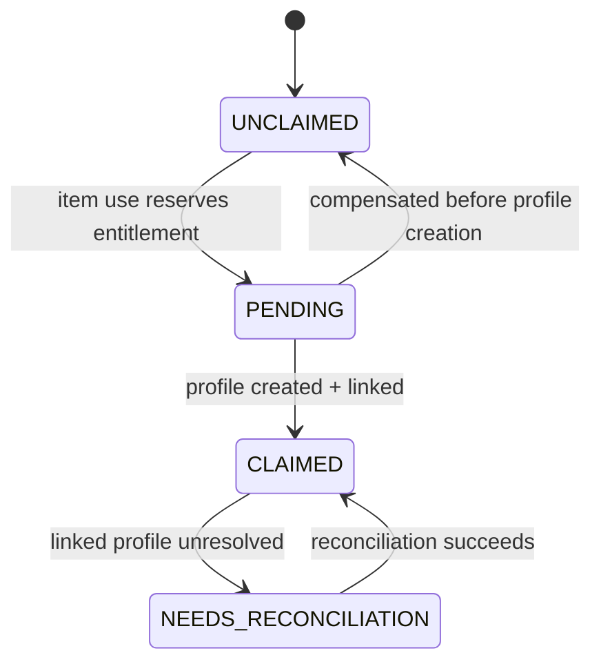

# Draconic Soul Bond and Miniwyvern Specification

Status: Implementation complete; release verification pending
Deferred: Miniwyvern backpack and Tamework companion inventory remain post-MVP
Scope: The unique, Soul Bond-exclusive Miniwyvern companion

## 1. Purpose and boundaries

The Draconic Soul Bond grants each player one persistent Miniwyvern. The companion stays small, follows and assists its owner, and may be re-attuned to seven elemental archetypes. It is not a capturable dragon and does not occupy the one-active-full-dragon slot. A small backpack is planned for a later update and is not part of the initial plugin release.

HyDragon owns the one-time entitlement, elemental meanings, abilities, and presentation. Tamework owns canonical companion profiles, active population admission, dynamic attachments, and lifecycle events. The deferred backpack will use Tamework's future generic companion inventory rather than a HyDragon-local storage system.

Related specifications:

- [Plugin architecture](plugin-architecture.md)
- [Capture, summoning, and maintenance](capture-summoning-maintenance.md)
- [Dragon content and encounters](dragon-content-encounters.md)
- Tamework [population groups](https://github.com/Alechilles/AlecsTamework/blob/main/docs/specs/hydragon/population-groups.md)
- Deferred Tamework [companion inventory](https://github.com/Alechilles/AlecsTamework/blob/main/docs/specs/hydragon/companion-inventory.md)
- Tamework [integration contract](https://github.com/Alechilles/AlecsTamework/blob/main/docs/specs/hydragon/integration-contract.md)

## 2. Locked decisions

- Miniwyvern is Soul Bond-exclusive. It has no normal world spawn, no Draconic Stone capture path, and no minimum stone tier.
- Each player may claim exactly one Soul Bond and own exactly one Soul Bond Miniwyvern.
- The Miniwyvern uses a canonical Tamework profile and remains the same companion through attunement, death/recovery, logout, and restart.
- The Miniwyvern may be active alongside one full dragon because it belongs to a separate population group.
- The backpack is deferred post-MVP. When implemented, it uses generic Tamework companion inventory; HyDragon only configures capacity, access, and presentation.
- Elemental archetype mechanics are HyDragon domain behavior and do not belong in Tamework core.

## 3. Requirements

### Soul Bond entitlement and lifecycle

- **HYD-SOUL-001:** HyDragon MUST add a Draconic Soul Bond item crafted only at the Draconic Altar and handled by a namespaced plugin interaction.
- **HYD-SOUL-002:** Successful use MUST atomically reserve the player's once-per-player entitlement, provision exactly one owned Miniwyvern profile through Tamework's `COMPANION_PROVISIONING` capability, link it in the player record, admit it to its population group, and consume exactly one Soul Bond item.
- **HYD-SOUL-003:** If the player already has a claimed or recoverable Soul Bond, use MUST be denied without consuming the item or creating another profile.
- **HYD-SOUL-004:** `Wyvern_Mini` and `Tamed_Wyvern_Mini` MUST be excluded from every Draconic Stone capture declaration. Production world-spawn assets MUST not spawn wild Miniwyverns.
- **HYD-SOUL-005:** Soul Bond Miniwyverns MUST join `hydragon:soulbound_mini`, configured as one owned and one active per owner. They MUST NOT count against `hydragon:full_dragons`.
- **HYD-SOUL-006:** The Miniwyvern's profile ID, name, health/lifecycle, archetype, appearance, and progression MUST survive logout, restart, unload, and ordinary Tamework recovery. Any later attached inventory MUST follow the same identity.
- **HYD-SOUL-007:** Death MUST never revoke the once-per-player entitlement or permit a replacement claim. Provisioned Miniwyverns MUST qualify for command-link-independent `DEAD_REVIVABLE` recovery, restoring the linked profile through Tamework rather than creating a new Miniwyvern.

### Core companion behavior

- **HYD-SOUL-008:** The base Miniwyvern MUST remain visibly small, follow or hold on command, assist its owner with a basic bite, and use owner-safe target selection.
- **HYD-SOUL-009:** Miniwyvern MUST be non-mountable and MUST not use or require the Flightmaster's Talisman.

### Deferred post-MVP backpack

- **HYD-SOUL-010 (DEFERRED):** A later Miniwyvern update MUST expose a nine-slot owner-only backpack backed by Tamework companion inventory. Inventory mutations MUST remain authoritative and persistent through capture-independent lifecycle changes. This is not an initial-release requirement.
- **HYD-SOUL-011 (DEFERRED):** When the backpack update ships, access MUST be denied to non-owners, during an unresolved/dead transition, or when the inventory capability is unavailable. Denial MUST not drop, duplicate, or clear stored items. This is not an initial-release requirement.

### Elemental attunement

- **HYD-SOUL-012:** HyDragon MUST support exactly these v1 archetype IDs: `lightning`, `wind`, `ice`, `fire`, `water`, `nature`, and `void`, plus an initial neutral/unattuned state.
- **HYD-SOUL-013:** The owner MUST be able to re-attune the same Miniwyvern by consuming one configured elemental essence through an atomic interaction. Attunement MUST preserve identity, name, health ratio, and progression plus backpack contents after the deferred backpack is introduced.
- **HYD-SOUL-014:** Every archetype MUST provide a distinct appearance, effects/audio vocabulary, ability definition, and localized description. Appearance-only assets MUST not be treated as proof that runtime abilities are active.
- **HYD-SOUL-015:** Lightning MUST increase owner movement/action speed; Wind MUST increase owner movement, jump, and mobility; Ice MUST apply area slow/freeze buildup culminating in a bounded stun or equivalent reduced-mobility control.
- **HYD-SOUL-016:** Fire MUST use frequent fireball attacks with damage-over-time; Water MUST provide burst combat healing; Nature MUST provide lower-intensity periodic regeneration for sustained support.
- **HYD-SOUL-017:** Void MUST use projectiles or pulses that apply a bounded defense-reduction debuff. No archetype may apply an unbounded stacking modifier.
- **HYD-SOUL-018:** Archetype buffs, debuffs, healing, targeting, cooldowns, and stacking rules MUST be data-driven, source-keyed, owner-safe, world-thread-safe, and removed or reconciled when the Miniwyvern is inactive, dead, re-attuned, or no longer owned.

### First-release constraints

- **HYD-SOUL-019:** The first release MUST create Miniwyverns only through the Soul Bond entitlement flow. It MUST NOT ship a captured-Miniwyvern adoption path or compatibility state for development-only pre-release profiles/items.
- **HYD-SOUL-020:** Soul Bond creation, attunement, ability, and death/recovery behavior MUST pass the MVP acceptance matrix in section 13 before the initial plugin release. The deferred backpack has a separate later release gate.

## 4. Player and profile data model

### 4.1 Player entitlement

The [plugin architecture](plugin-architecture.md) defines the durable `HyDragonPlayerRecord`. Soul Bond uses these semantic states:



There is no transition from `CLAIMED` back to `UNCLAIMED` during ordinary gameplay. Administrative data repair may relink the existing profile but must not silently grant another claim.

### 4.2 Profile extension data

```text
companionKind: SOULBOUND_MINIWYVERN
archetypeId: neutral | lightning | wind | ice | fire | water | nature | void
archetypeRevision
lastAttunementOperationId
abilityState:
  cooldownsByAbilityId
  lastAppliedSourceKeys
```

Inventory contents remain in Tamework's companion-inventory store. HyDragon may retain only the configured inventory ID/capacity reference, not a second copy of item stacks.

## 5. Soul Bond creation transaction

1. Validate plugin/Tamework capabilities, owner identity, item identity, world state, and population-group admission.
2. Read the durable player record. Reject `CLAIMED`, a resolvable `NEEDS_RECONCILIATION`, or another live `PENDING` operation.
3. Persist a `PENDING` reservation with a unique operation ID before profile creation.
4. Request one owned `Tamed_Wyvern_Mini` profile from Tamework's idempotent provisioning API with initial lifecycle `PROVISIONED_DORMANT`. Tamework resolves group `hydragon:soulbound_mini`; HyDragon does not assert or mutate the group directly.
5. Persist the returned profile ID and transition to `CLAIMED`. A retry with the same operation key must return that profile rather than create another.
6. Consume one Draconic Soul Bond only after the durable link exists. If item consumption cannot commit, retain the pending operation and reconcile rather than creating another profile.
7. Request normal `PROVISIONED_DORMANT -> RESTORING -> ACTIVE` projection only after population admission and safe-placement checks succeed. A failed projection leaves the claimed companion in `PROVISIONED_DORMANT`; it does not undo the entitlement or create a replacement.

The exact transaction/compensation primitives must follow the Tamework [integration contract](https://github.com/Alechilles/AlecsTamework/blob/main/docs/specs/hydragon/integration-contract.md).

## 6. Companion behavior

### Base modes

- `Follow`: stay near the owner with the existing flying follow action.
- `Hold`: remain near the commanded point and defend according to policy.
- `Idle`: local wandering without abandoning owner bounds.
- `AttackTarget`: attack the owner's explicitly selected valid hostile.
- `Defend`: respond to hostile attacks on the owner or Miniwyvern.

The basic bite remains available in every archetype. Elemental attacks supplement rather than replace the base command/state machine unless the archetype config explicitly substitutes its attack package.

### Target safety

Automated abilities must reject the owner, same-owner companions, allies according to game attitude/team rules, dead/invalid entities, unloaded entities, and targets outside the configured world/range. Healing/support targets the owner in v1; party-wide support is out of scope unless a later config/API contract defines party membership.

## 7. Deferred post-MVP backpack contract

No backpack interaction, inventory config, capability requirement, persistence table, or UI is included in the initial HyDragon plugin release. This section preserves the later update contract: HyDragon will configure one nine-slot inventory for `hydragon:soulbound_mini` through the deferred Tamework [companion-inventory specification](https://github.com/Alechilles/AlecsTamework/blob/main/docs/specs/hydragon/companion-inventory.md).

Required behavior:

- Owner opens it through a distinct interaction/prompt that does not conflict with Feed or ModeCycle.
- Contents follow the canonical profile when the entity unloads, dies, is recovered, or the server restarts.
- Opening the same inventory twice cannot create two writable sessions.
- Closing, disconnecting, range loss, or entity unload commits or safely rolls back through Tamework's inventory transaction.
- Death does not spill contents by default.
- Full/incompatible item restrictions, if added later, are Tamework inventory policy rather than hardcoded slot logic.

When that update is implemented, the backpack feature is capability-gated. Missing inventory support removes only the open-backpack action and does not affect the companion lifecycle. Until then, HyDragon does not query `COMPANION_INVENTORY` or register a backpack action.

## 8. Attunement transaction

### Essence mapping

| Archetype | Accepted essence semantic ID | Existing asset reuse |
| --- | --- | --- |
| Lightning | `lightning` | Canonical English Lightning essence and appearance assets |
| Wind | `wind` | Canonical Wind essence and appearance assets |
| Ice | `ice` | Canonical English Ice essence and appearance assets |
| Fire | `fire` | Canonical English Fire essence and appearance assets |
| Water | `water` | Canonical Water essence and appearance assets |
| Nature | `nature` | Canonical Nature essence and appearance assets |
| Void | `void` | Canonical Void essence and appearance assets |

Canonical item IDs and direct pre-release renames are defined in [Dragon content and encounters](dragon-content-encounters.md).

### Transaction order

1. Resolve the owner's linked Miniwyvern profile, regardless of whether its projection is currently loaded.
2. Validate ownership, Soul Bond status, supported essence, target archetype, config references, and no conflicting lifecycle transition.
3. Reserve the essence stack and an operation ID.
4. Update namespaced profile data through the Tamework Profile Data API.
5. Apply/synchronize the configured appearance through Tamework's attachment/progression API and refresh runtime ability state.
6. Consume one essence exactly once and emit presentation.
7. On any failure before durable mutation, release the item reservation. On failure after durable mutation, reconcile presentation/item consumption by operation ID rather than applying the archetype twice.

Re-attuning to the current archetype is rejected without consumption by default. Servers may enable a cosmetic replay with no item cost; it cannot execute the mutation path.

## 9. Archetype behavior contract

| Archetype | Owner/support effect | Combat behavior | Stacking and safety |
| --- | --- | --- | --- |
| Lightning | Movement and action-speed increase | Fast lightning shots or strikes | One source-keyed buff per Miniwyvern; refresh, do not add |
| Wind | Movement, jump, and mobility increase | Optional knockback/gust utility | Clamp movement/jump modifiers to config maxima |
| Ice | None required | Area slow and freeze buildup; bounded stun/control at threshold | Per-target buildup cap and immunity/cooldown after control |
| Fire | None required | Frequent fireballs and bounded damage-over-time | Refresh or capped stacks; no friendly fire |
| Water | Burst combat healing | Low-frequency defensive attack optional | Respect burst cap and combat cooldown; never exceed max health |
| Nature | Lower-intensity periodic regeneration | Nature projectile or bite support optional | Source-keyed refresh with a sustained cadence distinct from Water |
| Void | None required | Projectile/pulse defense reduction | Configured floor and duration; no unbounded stacking |

Each definition includes:

```text
Id
EssenceSemanticId
AppearanceId
ParticleAndSoundIds
PassiveEffects[]
ActiveAbilities[]:
  trigger
  targetPolicy
  range
  cooldown
  effect/projectile IDs
  magnitude/duration/stacking policy
FallbackBehavior
```

If the base game cannot safely express one requested modifier, that ability must remain capability-disabled with a clear diagnostic. It must not be silently replaced with a mechanically different effect.

## 10. Assets versus plugin runtime

### Asset/config work

- Soul Bond item, icon, model, localization, and Draconic Altar recipe.
- Miniwyvern neutral plus seven archetype textures/models or dynamic attachment selections.
- Bite, projectile, status-effect, particle, sound, and animation assets.
- Tamed role parameters and Tamework interaction/companion/population configs; inventory config is deferred.
- `Server/HyDragon/MiniwyvernArchetypes/*.json` domain definitions.

### Implemented plugin runtime

- Once-per-player ledger and crash-safe claim transaction.
- Provisioned-profile creation/link reconciliation.
- Attunement interaction extension and atomic essence consumption.
- Ability scheduler/targeting and source-keyed buff/debuff cleanup.
- Capability gating and operator diagnostics.

### Implemented Tamework dependencies

- Canonical profile, ownership, events, profile data, attachment synchronization.
- Group limit `one owned / one active` enforcement.
- Post-MVP only: generic nine-slot inventory persistence/UI/transactions.

## 11. Completed pre-release configuration cleanup

The implemented configuration establishes the following clean first-release state:

1. `Wyvern_Mini`, `Tamed_Wyvern_Mini`, and the corresponding tamed-role override are absent from every stone config.
2. The Soul Bond entitlement ledger starts at `UNCLAIMED`; no development capture/adoption configuration is registered.
3. No profile adoption, filled-stone conversion, alias state, or other compatibility behavior exists for pre-release Miniwyvern data.
4. Because HyDragon has never been released, no migration of development/test profiles or worlds is supported or required.

## 12. Configuration and asset map

| Path | Purpose |
| --- | --- |
| `Server/Item/Items/Ingredient/Draconic_Soul_Bond.json` | Craftable one-time-use item and plugin interaction |
| `Server/HyDragon/MiniwyvernArchetypes/*.json` | Seven archetype behavior definitions |
| `Server/Tamework/Companion/HyDragonMiniwyvern.json` | Recall/recovery/cross-world behavior |
| `Server/Tamework/Interactions/HyDragonIntWyvernMini.json` | MVP Feed, mode, and attunement entry points; backpack action added only in the later update |
| `Server/Tamework/PopulationGroups/HyDragonSoulboundMiniwyvern.json` | `hydragon:soulbound_mini`, one owned/one active |
| Deferred Tamework companion-inventory asset path | Post-MVP nine-slot owner-only backpack |
| `Server/NPC/Roles/Creature/HyDragon/Wyvern_Mini/` | Tamed role; wild role retained only if required internally for provisioning |
| `Server/Models/HyDragon/Wyvern_Mini/` | Neutral and archetype appearances |
| `Common/NPC/HyDragon/Wyvern_Mini/` | Model, textures, animations |
| `Server/Projectiles/HyDragon/Wyvern_Mini/` | Fire/Ice/Void/etc. projectile assets |
| Status, particle, sound, and localization assets | Archetype presentation and mechanics |

Implemented Tamework asset paths are authoritative; the linked Tamework specifications define their reusable semantics.

## 13. Acceptance criteria

- First Soul Bond use creates one profile, consumes one item, and persists one `CLAIMED` record; simultaneous/retried uses cannot create two.
- A second Soul Bond use is denied without item loss, including after restart or Miniwyvern death.
- Every Draconic Stone tier rejects wild and tamed Miniwyvern roles, and no production spawn asset emits a wild Miniwyvern.
- One Miniwyvern and one full dragon can be active together; a second Miniwyvern admission is denied by Tamework.
- Missing `COMPANION_PROVISIONING` denies a new Soul Bond without item loss while leaving existing Miniwyverns usable.
- Follow, Hold, Defend/Attack Target, bite, logout/reload, death/recovery, and cross-world policy preserve the same profile ID.
- Each essence changes the same profile to the correct appearance and behavior while preserving name, health ratio, and progression.
- Repeated/retried attunement consumes one essence, not zero or two, and removes the previous archetype's runtime effects.
- Buff/debuff tests prove source-keyed refresh, configured caps, friendly-target rejection, and cleanup on inactive/dead/re-attuned state.
- A clean installation has no Miniwyvern capture/adoption path: every owned Miniwyvern originates from one committed Soul Bond claim.

Deferred backpack acceptance, not part of the initial release gate:

- The owner can store and retrieve nine backpack stacks across unload, death, and restart; a non-owner and a concurrent second UI session cannot mutate contents.
- Attunement and lifecycle transitions preserve all backpack contents once the feature exists.

## 14. Implemented dependency map

| Phase | HyDragon work | Required Tamework work |
| --- | --- | --- |
| S0 | Ordinary-capture exclusion and canonical item/model/effect IDs | Existing config/API |
| S1 | Durable player ledger and one-time Soul Bond transaction | Tamework `COMPANION_PROVISIONING` and [integration contract](https://github.com/Alechilles/AlecsTamework/blob/main/docs/specs/hydragon/integration-contract.md) |
| S2 | Unique Miniwyvern lifecycle | [Population groups](https://github.com/Alechilles/AlecsTamework/blob/main/docs/specs/hydragon/population-groups.md) |
| S3 | Neutral Miniwyvern plus Fire and Nature vertical slice | S1-S2 and Tamework profile/attachment APIs |
| S4 | Remaining five archetypes and full ability safety matrix | S3 |
| Post-MVP S5 | Enable nine-slot backpack in a later update | Deferred [companion inventory](https://github.com/Alechilles/AlecsTamework/blob/main/docs/specs/hydragon/companion-inventory.md) |
