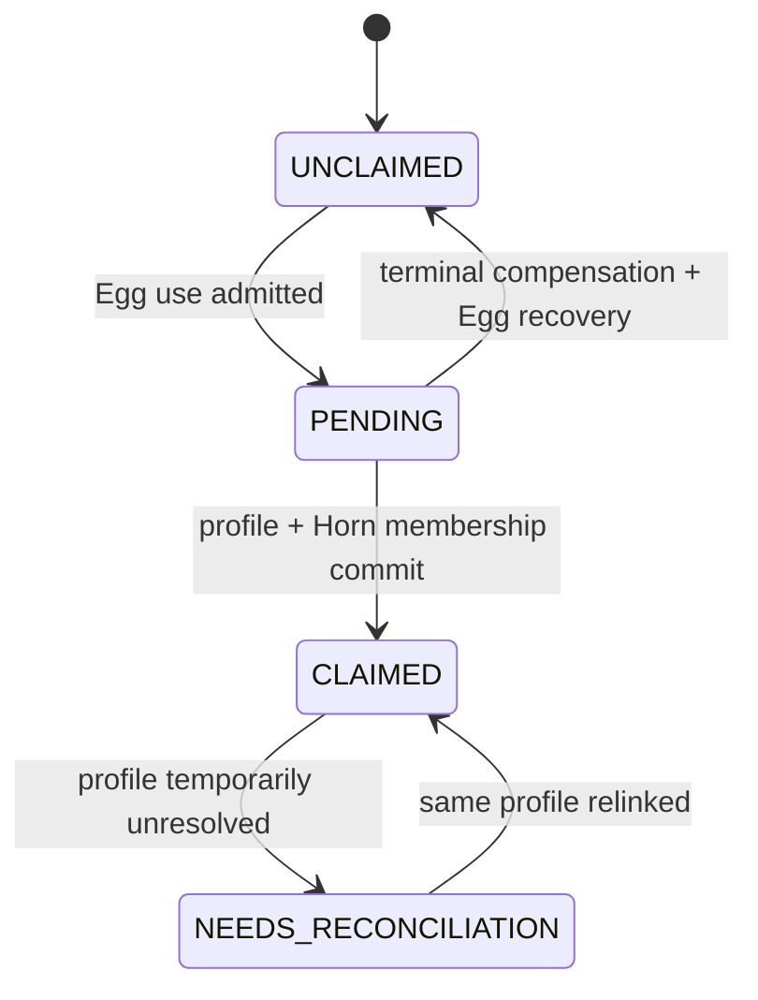

# Wyvern Egg, Soul Bond, and Miniwyvern Specification

Status: Proposed redesign; replaces the unreleased Soul Bound Wyvern item flow
Target dependency: Tamework `>=3.0.0 <4.0.0`

## 1. Purpose

The Wyvern Egg is a once-per-player ritual item that creates the player's lifelong Soul Bond Miniwyvern. Successful use consumes the egg, creates exactly one canonical Miniwyvern profile, and adds that profile to the same Dragon Horn roster used by full dragons. The Egg is not a recurring summon item, and no separate Soul Bound Wyvern item is created.

Related specifications:

- [Draconic capture, Dragon Horn, and revival](capture-summoning-maintenance.md)
- [Dragon content and encounters](dragon-content-encounters.md)
- [Plugin architecture](plugin-architecture.md)
- Tamework [command-roster capture and revival](https://github.com/Alechilles/AlecsTamework/blob/main/docs/specs/hydragon/command-roster-capture-revival.md)
- Tamework [population groups](https://github.com/Alechilles/AlecsTamework/blob/main/docs/specs/hydragon/population-groups.md)
- Deferred Tamework [companion inventory](https://github.com/Alechilles/AlecsTamework/blob/main/docs/specs/hydragon/companion-inventory.md)

## 2. Locked decisions

- Miniwyverns are Soul Bond-exclusive and cannot be captured with Draconic Stones.
- Each player can claim exactly one Miniwyvern for life.
- Successful Wyvern Egg use consumes the egg and adds the companion to command family `hydragon:dragon_horn`.
- The Dragon Horn is the only recurring command, recall, locate, and revive interface. `Soul_Bound_Wyvern` is removed.
- The claim preserves one canonical profile through death, unload, restart, and revival.
- Miniwyvern and one full dragon may be active together because they use separate population groups.
- The Miniwyvern uses the same timed-summon lifecycle with its own role-configured duration and cooldown; its timer is independent of every full dragon.
- The nine-slot backpack remains deferred to a later update.
- Elemental archetypes and their effects remain HyDragon-specific behavior.
- HyDragon is unreleased; no Egg, Soul Bound Wyvern, or profile migration is required.

## 3. Requirements

### Claim and roster integration

- **HYD-SOUL-001:** HyDragon MUST provide a craftable, non-placeable `Wyvern_Egg` using the dragon egg model and texture.
- **HYD-SOUL-002:** Claim preflight MUST require a compatible `HyDragon_Dragon_Horn`, an unclaimed entitlement, available Tamework provisioning/roster/population authority, and a valid player/world context.
- **HYD-SOUL-003:** Successful use MUST atomically reserve the lifelong entitlement, provision exactly one owned `Tamed_Wyvern_Mini` profile, add it to command family `hydragon:dragon_horn`, consume one Egg, and request safe projection in front of the player.
- **HYD-SOUL-004:** A player with a claimed, pending, dead, lost, unloaded, or recoverable Miniwyvern MUST be denied another claim without Egg consumption.
- **HYD-SOUL-005:** If initial projection is temporarily unavailable after the durable claim commits, the one profile remains in the Dragon Horn as dormant/recoverable. The player uses Horn Recall later; a new Egg cannot be used.
- **HYD-SOUL-006:** Duplicate use callbacks and restart recovery MUST reuse the same operation ID and return the same profile. They MUST NOT consume two Eggs, create two profiles, or add duplicate roster rows.
- **HYD-SOUL-007:** If the Egg was consumed but provisioning cannot terminally complete, recovery MUST produce one Egg refund/recovery claim and release the entitlement. It MUST never retain both a refundable Egg and a provisioned profile.

### Identity, population, and death

- **HYD-SOUL-008:** `Wyvern_Mini` and `Tamed_Wyvern_Mini` MUST be absent from all Draconic Stone allowlists and production wild-spawn assets.
- **HYD-SOUL-009:** Miniwyverns MUST join `hydragon:soulbound_mini`, configured as one owned and one active per owner. They MUST NOT count against `hydragon:full_dragons`.
- **HYD-SOUL-010:** Profile ID, name, health/lifecycle, archetype, appearance, progression, and future backpack identity MUST survive ordinary lifecycle changes.
- **HYD-SOUL-011:** Death MUST preserve the claimed entitlement and Dragon Horn row in `DEAD_REVIVABLE`. Revival restores the same profile and uses the paid Horn revival contract in [the capture specification](capture-summoning-maintenance.md#death-and-paid-revival).
- **HYD-SOUL-012:** Death, profile loss, item loss, or unlinking MUST NOT allow a replacement claim. Administrative repair relinks the existing profile or explicitly resolves a quarantined claim.

### Companion behavior

- **HYD-SOUL-013:** The Miniwyvern MUST remain visibly small, non-mountable, able to Follow/Hold/Idle, and able to assist its owner with a basic bite and owner-safe targeting.
- **HYD-SOUL-014:** The Miniwyvern MUST be controllable through the Dragon Horn's normal linked panel and command actions. It MUST NOT require a dedicated summon item.
- **HYD-SOUL-015:** Projection and Recall MUST use safe in-front-of-player placement, matching the full-dragon behavior.
- **HYD-SOUL-015A:** Successful Egg projection starts the Miniwyvern's first summon lease. Expiry or manual Dismiss MUST return the same profile to `ROSTER_STORED`; the Dragon Horn shows remaining time, stored status, and resummon cooldown.
- **HYD-SOUL-015B:** Horn Summon after cooldown starts a new configured lease. Recall, attunement, unload, travel, and restart MUST NOT reset a running lease. Owner logout follows the configured auto-storage transaction and cooldown; logging back in cannot immediately convert that stored profile into a fresh active lease.

### Elemental attunement

- **HYD-SOUL-016:** HyDragon MUST support `neutral`, `lightning`, `wind`, `ice`, `fire`, `water`, `nature`, and `void` archetype IDs.
- **HYD-SOUL-017:** Consuming one configured elemental essence re-attunes the same profile and preserves name, health ratio, progression, roster membership, and future backpack contents.
- **HYD-SOUL-018:** Every archetype MUST provide distinct presentation, a localized description, and a data-driven ability definition. Appearance assets alone do not count as working behavior.
- **HYD-SOUL-019:** Lightning increases movement/action speed; Wind increases movement, jump, and mobility; Ice applies bounded slow/freeze buildup and control.
- **HYD-SOUL-020:** Fire uses frequent fireball attacks with bounded damage-over-time; Water provides burst combat healing; Nature provides lower-intensity periodic regeneration.
- **HYD-SOUL-021:** Void applies bounded defense reduction. No archetype may stack an unbounded modifier.
- **HYD-SOUL-022:** Ability targeting, cooldowns, effects, stacking, and cleanup MUST be source-keyed, owner-safe, data-driven, and world-thread-safe.

### Deferred backpack

- **HYD-SOUL-023 (DEFERRED):** A later update MAY add a nine-slot owner-only backpack backed by Tamework's generic companion inventory.
- **HYD-SOUL-024 (DEFERRED):** The initial release MUST NOT register backpack interactions, config, persistence, or UI. The future feature cannot alter Egg, Horn, capture, or revival semantics.

## 4. Entitlement state machine


```mermaid
stateDiagram-v2
    [*] --> UNCLAIMED
    UNCLAIMED --> PENDING: Egg use admitted
    PENDING --> CLAIMED: profile + Horn membership commit
    PENDING --> UNCLAIMED: terminal compensation + Egg recovery
    CLAIMED --> NEEDS_RECONCILIATION: profile temporarily unresolved
    NEEDS_RECONCILIATION --> CLAIMED: same profile relinked
```

Ordinary gameplay has no `CLAIMED -> UNCLAIMED` transition. A dead or unprojected Miniwyvern is still claimed.

## 5. Claim transaction

1. Resolve the acting player, exact Egg stack, registered Dragon Horn access, and current Tamework capabilities.
2. Read and fence the player's entitlement. Reject any existing `PENDING`, `CLAIMED`, or reconcilable profile.
3. Prepare `hydragon:soulbound_mini` owner/population admission and `hydragon:dragon_horn` command-family membership.
4. Persist a namespaced operation ID and `PENDING` entitlement before consuming the Egg.
5. Exact-CAS consume one Egg.
6. Call Tamework provisioning with the same idempotency key for one `Tamed_Wyvern_Mini` profile.
7. Commit profile ID, `CLAIMED`, and Dragon Horn membership as one recoverable operation.
8. Request safe projection in front of the player and begin one role-configured summon lease. Projection failure leaves the committed profile dormant and visible in the Horn without starting a lease.
9. Emit one localized success or recovery-pending message.

No callback may create a new operation merely because the original callback timed out.

## 6. Profile data

HyDragon's namespaced profile extension contains only domain behavior:

```text
companionKind: SOULBOUND_MINIWYVERN
archetypeId: neutral | lightning | wind | ice | fire | water | nature | void
archetypeRevision
lastAttunementOperationId
abilityState:
  cooldownsByAbilityId
  lastAppliedSourceKeys
```

Entitlement state belongs to the HyDragon player record. Profile identity/lifecycle, Horn membership, and population state belong to Tamework. Inventory contents remain deferred and, when added, belong to Tamework's profile-scoped inventory store.

## 7. Attunement contract

| Archetype | Essence semantic ID | Required behavior |
| --- | --- | --- |
| Lightning | `lightning` | Movement/action speed and fast lightning attacks |
| Wind | `wind` | Movement/jump/mobility and gust utility |
| Ice | `ice` | Slow/freeze buildup with bounded control |
| Fire | `fire` | Frequent fireballs and bounded damage-over-time |
| Water | `water` | Burst combat healing |
| Nature | `nature` | Sustained periodic regeneration |
| Void | `void` | Projectile/pulse defense reduction with a floor |

Attunement reserves one essence, updates profile data and appearance under one idempotency key, consumes once, and reconciles presentation after restart. Re-attuning to the current archetype is denied without consumption by default.

## 8. Assets and configuration

| Path or ID | Required result |
| --- | --- |
| `Server/Item/Items/Ingredient/Wyvern_Egg.json` | One-time ritual consumable using the dragon egg appearance |
| `Soul_Bound_Wyvern` | Delete item, interaction, recipe, localization, tests, and runtime references |
| `HyDragon_Dragon_Horn` | Shared recurring interface for Miniwyvern and full dragons |
| `Server/Tamework/Companion/HyDragonMiniwyvern.json` | Population, command, timed-summon, paid-revival, placement, and lifecycle settings |
| `Server/Tamework/Items/Commands/HyDragonDragonHorn.json` | Allows all supported tamed full-dragon roles plus `Tamed_Wyvern_Mini` |
| `Server/HyDragon/MiniwyvernArchetypes/*.json` | Neutral and seven elemental definitions |
| `Server/Languages/{en-US,pt-BR,de-DE,fr-FR,es-ES}/server.lang` | Matching Egg, claim, Horn, lifecycle, revival, and archetype keys/placeholders |

Canonical asset IDs use English. Locale catalogs translate player-facing text only.

## 9. Acceptance criteria

- First valid Egg use consumes one Egg, commits one entitlement, creates one profile, adds one Horn row, and attempts one in-front projection.
- A simultaneous, duplicate, restarted, or repeated claim cannot consume twice or create a second profile.
- Existing claimed/dead/lost/dormant states deny a new Egg without consumption.
- Missing Dragon Horn, capability, population authority, or valid inventory source denies before Egg consumption.
- Projection failure after claim leaves the one profile visible and Recall-capable through the Horn.
- Every stone tier rejects both Miniwyvern roles without rolling or consuming.
- Miniwyvern and one full dragon can be active together; a second Miniwyvern cannot be owned or projected.
- Egg projection, Horn Summon, timed expiry, manual Dismiss, and resummon cooldown preserve the same Miniwyvern profile; no callback or restart resets its lease.
- Death preserves the one profile and entitlement; paid revival restores that profile through the Horn.
- Follow, Hold, Recall, commands, death/revival, logout, cross-world travel, and restart preserve the same profile and roster membership.
- Each elemental essence changes the same profile once and cleans up the prior archetype's effects.
- The packaged initial release contains no `Soul_Bound_Wyvern` asset or runtime path and no backpack feature.

## 10. Delivery order

1. Tamework owner-command-family roster and atomic provisioning/link support.
2. HyDragon Egg claim transaction conversion.
3. Dragon Horn asset/config and Miniwyvern role inclusion.
4. Removal of the Soul Bound Wyvern item and interaction.
5. Paid revival and in-front placement integration.
6. Ability and lifecycle regression tests plus multilingual asset validation.
